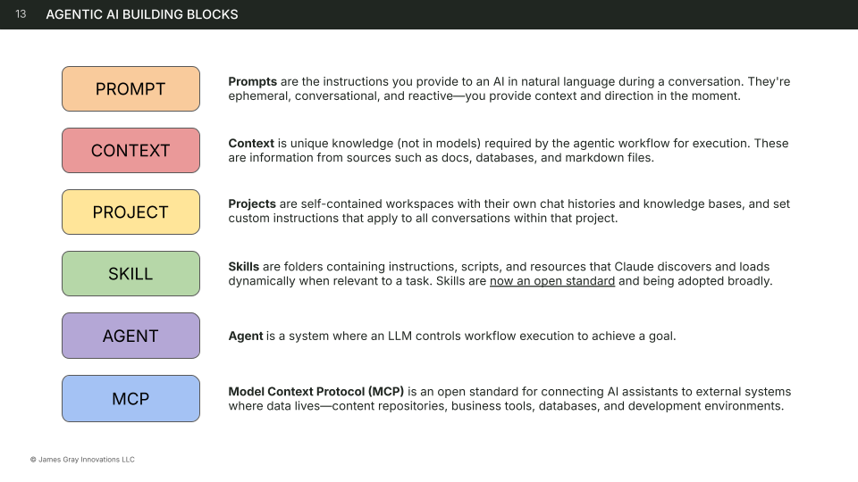

# Agentic AI Building Blocks

> **Platforms:** `claude` `openai` `gemini` `m365-copilot`

## Overview

The six AI building blocks are a shared vocabulary for describing the components of any AI workflow. Whether you're writing a single prompt or orchestrating a multi-agent pipeline, every AI workflow is assembled from some combination of these six pieces.

The blocks progress from simple to complex:

**Prompt** → **Context** → **Project** → **Skill** → **Agent** → **MCP**

These are platform-agnostic concepts. Every major AI platform implements them, though the names and interfaces differ. Understanding the blocks gives you a mental model that transfers across tools — you can evaluate any platform by asking "how does it handle prompts, context, projects, skills, agents, and external connections?"

!!! tip "Using building blocks for workflow analysis"
    The [Business-First AI Framework](../business-first-ai-framework/index.md) uses these six blocks as the analysis tool in [Phase 2 — Deconstruct](../business-first-ai-framework/deconstruct/building-blocks.md), where each step of a workflow gets mapped to the building blocks it needs.

## Summary

| Block | What It Is | Persistence | Complexity |
|-------|-----------|-------------|------------|
| **Prompt** | A well-crafted instruction that tells the model what to do | Single use | Low |
| **Context** | Background information, reference docs, or examples the model needs | Per conversation or persistent | Low |
| **Project** | A persistent workspace grouping prompts, context, skills, and agents | Persistent | Medium |
| **Skill** | A reusable, parameterized routine the model can invoke | Persistent and reusable | Medium |
| **Agent** | An autonomous AI that plans, uses tools, and executes multi-step work | Session-based or persistent | High |
| **MCP** | A connector that lets AI access external tools, services, or databases | Persistent | High |

## The Six Building Blocks

### Prompt

Instructions you provide to an AI in natural language during a conversation. Prompts are ephemeral, conversational, and reactive — you provide context and direction in the moment.

**Key characteristics:**

- The most fundamental building block — every AI interaction starts with a prompt
- Can range from a single sentence to a detailed multi-section instruction
- Ephemeral by default: conversational and reactive, used in the moment

**When to use it:** Any time you interact with an AI model. A good prompt is sufficient for many tasks without needing other blocks.

**Example:** "Summarize this quarterly sales report in three bullet points, highlighting the biggest change from last quarter."

**Cross-platform implementations:**

| Platform | How It Works |
|----------|-------------|
| Claude | Message in conversation, system prompt, or project instructions |
| OpenAI (ChatGPT) | Message in conversation, system prompt, or Custom GPT instructions |
| Gemini | Message in conversation or Gem instructions |
| M365 Copilot | Message in chat, or prompt within a Copilot agent |

**Relationship to other blocks:** Prompts are the foundation — context enhances them, skills package them for reuse, and agents chain them together.

---

### Context

Unique knowledge (not in models) required by the agentic workflow for execution. These are information from sources such as docs, databases, and markdown files.

**Key characteristics:**

- Provides knowledge the model doesn't have — your data, your docs, your domain
- Can be inline (pasted into the conversation), attached as files, or pre-loaded in a project
- Improves output quality by grounding the model in your specific domain

**When to use it:** When the model needs information it wasn't trained on — your company's style guide, a product spec, customer data, or examples of desired output format.

**Example:** Attaching your brand voice guidelines and three sample blog posts before asking the model to draft a new one.

**Cross-platform implementations:**

| Platform | How It Works |
|----------|-------------|
| Claude | File attachments, project knowledge base, conversation history |
| OpenAI (ChatGPT) | File uploads, Custom GPT knowledge files, conversation history |
| Gemini | File uploads, Google Drive integration, NotebookLM sources |
| M365 Copilot | Microsoft Graph (emails, files, meetings), attached documents |

**Relationship to other blocks:** Context makes prompts smarter. Projects organize context persistently so you don't re-upload it every time.

---

### Project

Self-contained workspaces with their own chat histories and knowledge bases that set custom instructions applying to all conversations within the project.

**Key characteristics:**

- Organizes related resources in one place so they persist across conversations
- Sets custom instructions that apply to every conversation in the project
- Reduces setup time: start a new conversation with everything already in place

**When to use it:** When you run the same type of workflow repeatedly and want to avoid re-uploading context and re-explaining instructions every time.

**Example:** A "Weekly Client Reports" project that contains your report template, client data, brand guidelines, and standing instructions for tone and format.

**Cross-platform implementations:**

| Platform | How It Works |
|----------|-------------|
| Claude | Claude Projects (with project knowledge and custom instructions) |
| OpenAI (ChatGPT) | Custom GPTs, or Projects in ChatGPT |
| Gemini | Gems (with custom instructions and uploaded context) |
| M365 Copilot | Copilot agents with knowledge sources and instructions |

**Relationship to other blocks:** Projects are containers — they hold the prompts, context, and skills a workflow needs, making the whole package reusable.

---

### Skill

Folders containing instructions, scripts, and resources that the AI discovers and loads dynamically when relevant to a task. Skills are now an open standard and being adopted broadly.

**Key characteristics:**

- Encapsulates a specific capability: instructions, context, and output format bundled together
- Dynamically loaded: the AI discovers and invokes skills when they're relevant
- Reusable across conversations, shareable with others, and becoming an open standard

**When to use it:** When you find yourself writing the same prompt repeatedly, or when a workflow step is well-defined enough to package as a repeatable routine.

**Example:** A "Draft Meeting Recap" skill that takes meeting notes as input and produces a formatted summary with action items, decisions, and follow-ups — in your team's standard format every time.

**Cross-platform implementations:**

| Platform | How It Works |
|----------|-------------|
| Claude | Claude Code Skills (SKILL.md files with instructions and references) |
| OpenAI (ChatGPT) | Custom GPTs, or Actions within a GPT |
| Gemini | Gems with structured instructions |
| M365 Copilot | Copilot agent actions, Power Automate flows triggered by Copilot |

**Relationship to other blocks:** Skills are upgraded prompts — they package a prompt with its context into something reusable. Agents can invoke skills as part of multi-step workflows.

!!! info "Skills vs. Agents"
    A skill is a **routine** — it does one thing well when invoked. An agent is **autonomous** — it decides what to do, which tools to use, and when to invoke skills. Think of skills as tools in a toolbox and agents as the person using the toolbox.

---

### Agent

A system where an LLM controls workflow execution to achieve a goal.

**Key characteristics:**

- Plans its own approach: breaks goals into steps and decides which tools to use
- Uses tools: can read files, search the web, run code, call APIs
- Iterates: evaluates its own output, handles errors, and adjusts course

**When to use it:** When a workflow requires multiple steps, tool use, or decision-making that would be tedious to manage manually through individual prompts.

**Example:** A research agent that takes a topic, searches multiple sources, synthesizes findings, fact-checks claims, and produces a structured report — deciding on its own which sources to consult and how deep to go.

**Cross-platform implementations:**

| Platform | How It Works |
|----------|-------------|
| Claude | Claude Code agents (autonomous tool-using sessions), Cowork agents |
| OpenAI (ChatGPT) | Custom GPTs with Actions, Assistants API with tools |
| Gemini | Gemini with extensions (Google Search, Workspace, Maps, etc.) |
| M365 Copilot | Copilot agents with plugins and connectors |

**Relationship to other blocks:** Agents orchestrate the other blocks — they use prompts, draw on context, invoke skills, and connect to external systems through MCP.

---

### MCP (Model Context Protocol)

An open standard for connecting AI assistants to external systems where data lives — content repositories, business tools, databases, and development environments.

**Key characteristics:**

- Bridges the gap between the AI and the outside world where your data lives
- Open standard: one integration pattern that works across compatible platforms
- Enables read and write operations: the AI can both retrieve information and take actions

**When to use it:** When the AI needs to interact with external systems — reading from a database, posting to Slack, creating tasks in a project management tool, or accessing live data.

**Example:** An MCP connector to your CRM that lets the AI look up client history, check deal status, and log meeting notes — all within the conversation.

**Cross-platform implementations:**

| Platform | How It Works |
|----------|-------------|
| Claude | MCP servers (local or remote) connected via Claude Code or Claude Desktop |
| OpenAI (ChatGPT) | Function calling, Actions in Custom GPTs, Assistants API tools |
| Gemini | Extensions and function calling |
| M365 Copilot | Connectors, plugins, Power Platform integrations |

!!! note "MCP is not Claude-only"
    While Anthropic created the MCP standard, it's an open protocol. OpenAI, Google, and Microsoft are adopting or building compatible approaches. The concept — giving AI standardized access to external tools — exists on every platform, even when the implementation differs.

**Relationship to other blocks:** MCP extends what agents and skills can do by connecting them to external systems. Without MCP, the AI is limited to what's in the conversation.

## How the Blocks Fit Together

The building blocks build on each other. Here's how a workflow grows as you adopt more blocks:

1. **Start with a Prompt** — Write clear instructions for what you want done
2. **Add Context** — Attach reference materials so the model has what it needs
3. **Organize in a Project** — Group your prompt and context so they persist across conversations
4. **Package as a Skill** — Turn the prompt + context into a reusable routine you can invoke with different inputs
5. **Connect with MCP** — Give the skill access to external data and tools
6. **Orchestrate with an Agent** — Let an autonomous AI run the skill, use MCP connections, and handle multi-step workflows

### Worked example: Weekly Client Status Report

| Stage | What Changes |
|-------|-------------|
| **Prompt only** | You paste "Write a status report for Client X covering this week's deliverables..." into a chat every Monday |
| **+ Context** | You attach the client's project brief and last week's report so the model has history |
| **+ Project** | You create a "Client Reports" project with the brief, templates, and standing instructions pre-loaded |
| **+ Skill** | You package "generate weekly status report" as a skill — now you just invoke it with this week's updates |
| **+ MCP** | The skill pulls this week's completed tasks from your project management tool and time entries from your time tracker |
| **+ Agent** | An agent runs every Monday: gathers data via MCP, generates the report using the skill, drafts an email, and flags anything that needs your review |

**Not every workflow needs every block.** Many tasks are handled perfectly well with a prompt and some context. The blocks are a menu, not a checklist — use what the workflow actually requires.

## Platform Comparison

All six building blocks across all four platforms in one view:

| Building Block | Claude | OpenAI (ChatGPT) | Gemini | M365 Copilot |
|---------------|--------|-------------------|--------|--------------|
| **Prompt** | Conversation messages, system prompts | Conversation messages, system prompts | Conversation messages | Chat messages |
| **Context** | File attachments, project knowledge | File uploads, GPT knowledge files | File uploads, Drive, NotebookLM | Microsoft Graph, documents |
| **Project** | Claude Projects | Custom GPTs, ChatGPT Projects | Gems | Copilot agents |
| **Skill** | Claude Code Skills | Custom GPTs, Actions | Gems with instructions | Agent actions, Power Automate |
| **Agent** | Claude Code agents, Cowork | Assistants API, GPTs with Actions | Extensions | Copilot agents with plugins |
| **MCP** | MCP servers | Function calling, Actions | Extensions, function calling | Connectors, plugins |

## Common Misconceptions

**"Skills and agents are the same thing."**
Skills are routines — they do one specific thing when invoked. Agents are autonomous — they decide what to do, plan steps, and invoke skills (among other tools) to accomplish goals. A skill is a tool; an agent is the one using the toolbox.

**"You need all six blocks for every workflow."**
Most workflows need two or three blocks. A well-written prompt with good context handles many tasks. Only add blocks when the workflow genuinely requires them.

**"MCP is a Claude-only technology."**
MCP is an open protocol created by Anthropic, but the concept of connecting AI to external tools exists on every platform. OpenAI uses function calling and Actions, Gemini uses extensions, and M365 Copilot uses connectors and plugins.

**"A project is just a folder."**
A project is an active workspace — it provides standing instructions, persistent context, and conversation continuity. It shapes how the AI behaves for every conversation within it, not just where files are stored.

## Related

**Framework and courses:**

- [Business-First AI Framework](../business-first-ai-framework/index.md) — applies building blocks to workflow analysis
- [Phase 2 — AI Building Blocks](../business-first-ai-framework/deconstruct/building-blocks.md) — mapping workflow steps to blocks
- [Agentic AI for Leaders](../courses/leaders/index.md) — course covering AI strategy and building blocks
- [Claude for Builders](../courses/builders/index.md) — hands-on course building with these blocks

**Fundamentals deep-dives:**

- [Prompts](prompts/index.md) — the Prompt building block, with prompt engineering techniques
- [Context](context/index.md) — background information and reference materials
- [Projects](projects/index.md) — project workspaces with memory, knowledge bases, and custom instructions
- [Skills](skills/index.md) — reusable, parameterized routines
- [Agents](agents/index.md) — concepts for the Agent building block
- [MCP](mcp/index.md) — connecting AI to external systems
- [Patterns](../patterns/index.md) — reusable approaches across building blocks

**Platform-specific guides:**

- [Claude Projects](../platforms/claude/projects/claude-projects-setup.md) — setting up the Project block on Claude
- [Claude Skills](../platforms/claude/skills/skills-discovery-meta-prompt.md) — discovering Skills on Claude
- [Claude Subagents](../platforms/claude/subagents/scheduling-subagents.md) — scheduling Agents on Claude
