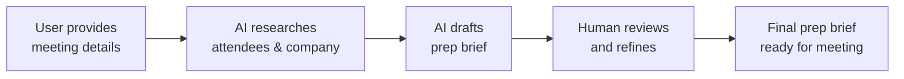

# AI Collaborative

> **AI involvement:** AI handles research and drafting; the human steers, reviews, and decides.

## What This Workflow Type Is

An AI collaborative workflow is one where the human and AI work together — the AI performs tasks like research, analysis, or drafting, and the human provides judgment, context, and final decisions. Neither operates alone. The human sets the direction; the AI handles the legwork.

!!! info "At a Glance"
    - **AI involvement:** Researches, drafts, and analyzes — but defers to human judgment
    - **Human oversight:** Active — reviews output, provides direction, makes decisions
    - **Best for:** Meeting prep, competitive analysis, draft creation, exploratory research
    - **Complexity:** Medium — may use an agent and/or skill, with a portable prompt as a lightweight alternative

### Characteristics

- **Iterative** — the human and AI go back and forth, refining the output
- **Judgment-dependent** — the AI can gather and organize information, but the human decides what matters
- **Context-rich** — the AI benefits from knowing the human's goals, preferences, and constraints
- **Quality-gated** — the human reviews before the output is used

### When to Use

Use AI collaborative workflows when the task:

- Requires research, synthesis, or analysis that's time-consuming for a human
- Involves subjective judgment that can't be fully encoded in rules
- Benefits from a draft that the human can refine rather than create from scratch
- Produces higher-quality output when a human reviews and adjusts

## Example Scenario

**The problem:** Before important meetings — sales calls, partnership discussions, interviews — a professional spends 20-45 minutes manually researching attendees on LinkedIn, scanning company news, and assembling talking points. The research is necessary but tedious, and the quality varies depending on how much time is available.

**The solution:** An AI agent that handles the research and produces a structured meeting prep brief. The human reviews the brief, adjusts the talking points, and walks into the meeting prepared — with a fraction of the manual effort.

## Building Blocks

| Building Block | Type | Description | Source |
|-------|------|-------------|--------|
| `meeting-prep-researcher` | Agent | Researches attendees and companies, produces a meeting prep brief | [View on GitHub](https://github.com/jamesgray-ai/handsonai/blob/main/plugins/business-first-ai/agents/meeting-prep-researcher.md) |
| `preparing-meeting-briefs` | Skill | Step-by-step research workflow for the agent to follow | [View on GitHub](https://github.com/jamesgray-ai/handsonai/tree/main/plugins/business-first-ai/skills/preparing-meeting-briefs/) |
| `meeting-prep-quick` | Prompt | Portable one-shot prompt for quick meeting prep in any AI tool | [View on GitHub](https://github.com/jamesgray-ai/handsonai/blob/main/plugins/business-first-ai/prompts/meeting-prep-quick.md) |

## How It Works



**Step-by-step:**

1. **User provides context** — who the meeting is with, what company, what the meeting is about, and what outcome they want.
2. **AI researches attendees** — searches for LinkedIn profiles, recent posts, and public activity for each person.
3. **AI researches the company** — finds recent news, strategic direction, and relevant industry context.
4. **AI drafts the prep brief** — produces a structured document with attendee profiles, company snapshot, suggested talking points, questions to ask, and potential landmines.
5. **Human reviews and refines** — the user reads the brief, adjusts talking points to match their style and goals, and decides what to use in the meeting.

## Usage

=== "Any AI Tool (Portable)"

    Use the **meeting-prep-quick** prompt for a lightweight, one-shot version in any AI tool.

    1. Open the [meeting-prep-quick prompt](https://github.com/jamesgray-ai/handsonai/blob/main/plugins/business-first-ai/prompts/meeting-prep-quick.md) on GitHub
    2. Copy the prompt from the code block
    3. Paste it into Claude, ChatGPT, Gemini, or M365 Copilot
    4. Fill in the meeting details and send
    5. Review the output and adjust talking points to match your style

=== "Claude Code (Plugin)"

    With the `business-first-ai` plugin installed, the **meeting-prep-researcher** agent activates automatically when you ask about meeting preparation.

    ```bash
    # Install the plugin (one time)
    /plugin install business-first-ai@handsonai
    ```

    Then describe your meeting in a Claude Code conversation:

    > "I have a sales call with Maria Torres, VP of Product at DataFlow Labs, on Thursday. Help me prepare."

    The agent will:

    - Research Maria Torres and DataFlow Labs
    - Produce a structured prep brief
    - Ask if you want to go deeper on any section

    The agent + skill combination provides a richer, more iterative experience than the one-shot prompt — it can ask follow-up questions, refine talking points based on your feedback, and adjust depth based on how much time you have.

## Adapting This Example

Meeting prep is one scenario, but the collaborative pattern applies to any task where AI handles research and drafting while the human provides judgment:

- **Competitive analysis** — AI researches competitors, drafts a comparison matrix; human validates and adds strategic context
- **Proposal drafting** — AI structures a proposal based on requirements; human refines messaging and adds relationship context
- **Job candidate screening** — AI summarizes resumes and flags qualifications; human makes interview decisions
- **Customer research** — AI compiles account history and recent activity; human identifies upsell opportunities

To adapt: identify tasks where you spend significant time gathering information before applying judgment. The gathering is AI work; the judgment is human work.

## Related

- [Deterministic Automation Workflow Example](./deterministic-automation.md) — when AI follows fixed rules with no judgment needed
- [Autonomous Agent Workflow Example](./autonomous-agent.md) — when AI executes end-to-end with minimal supervision
- [Research Use Cases](../../use-cases/research.md) — more examples of AI-powered research workflows like meeting prep
- [Ideation & Strategy Use Cases](../../use-cases/ideation-and-strategy.md) — collaborative brainstorming and planning with AI
- [Discover AI Workflow Opportunities](../discover.md) — discover which workflows are candidates for AI collaboration
- [Deconstruct Workflows](../deconstruct/index.md) — break down workflows into AI-ready steps
