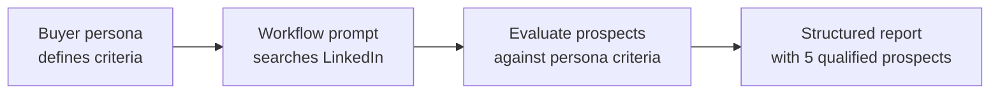

# Deterministic Automation

> **AI involvement:** Executes a predefined sequence — criteria come from the input, output follows a fixed template.

## What This Workflow Type Is

A deterministic automation is a workflow where AI follows a fixed sequence of steps, applies predefined evaluation criteria, and produces output in a rigid template. The rules are defined upfront (in this case, by a buyer persona), the process is linear, and the output format never changes. The same input produces the same structured output every time.

!!! info "At a Glance"
    - **AI involvement:** Follows prescribed steps and applies predefined criteria
    - **Human oversight:** Review output only — no steering during execution
    - **Best for:** Prospecting, recurring reports, data formatting, template-driven research
    - **Complexity:** Low — single prompt with structured input, no iteration required

### Characteristics

- **Repeatable** — runs the same way every time with any buyer persona
- **Predictable** — output format and evaluation criteria are defined in advance
- **Delegatable** — anyone with the persona file can run it and get consistent results
- **Automatable** — can run on a schedule or be triggered by a pipeline

### When to Use

Use deterministic automation when you have a task that:

- Follows clear, documented rules or criteria
- Takes structured input and produces structured output
- Doesn't require subjective judgment during execution
- Repeats on a regular cadence (weekly prospecting, monthly reporting)

## Example Scenario

**The problem:** A sales leader needs to identify LinkedIn prospects that match a specific buyer persona. The research process is always the same — search by title and industry, evaluate against persona criteria, document findings in a consistent format — but manually doing it takes 45-60 minutes per batch. The criteria don't change between runs; only the prospects found are different.

**The solution:** A workflow prompt that takes a buyer persona as input, executes a prescribed LinkedIn research sequence, and produces a structured prospect report with engagement recommendations. The evaluation criteria come directly from the persona file, so there's no subjective judgment — just systematic matching.

## Building Blocks

| Building Block | Type | Description | Source |
|-------|------|-------------|--------|
| `linkedin-prospect-research` | Prompt | Workflow that finds and qualifies 5 LinkedIn prospects against a buyer persona | [View on GitHub](https://github.com/jamesgray-ai/handsonai/blob/main/plugins/business-first-ai/prompts/linkedin-prospect-research.md) |
| `buyer-persona-revenue-leader-rachel` | Prompt | Example buyer persona used as input to the research workflow | [View on GitHub](https://github.com/jamesgray-ai/handsonai/blob/main/plugins/business-first-ai/prompts/buyer-persona-revenue-leader-rachel.md) |

## How It Works



**Step-by-step:**

1. **Provide the buyer persona** — the persona file defines the target titles, industries, company sizes, pain points, and trigger events. These become the evaluation criteria.
2. **Workflow analyzes the persona** — extracts job titles, industry, company size, seniority, location, and exclusion criteria.
3. **Workflow searches LinkedIn** — uses the persona criteria as search filters, systematically reviewing results.
4. **Workflow evaluates each prospect** — checks role match, company fit, engagement signals, and accessibility (mutual connections, shared groups). Selects the top 5.
5. **Workflow generates the report** — documents each prospect with profile URL, title, company, persona match reasons, and a specific engagement hook. Includes a summary with selection rationale, common themes, and priority ranking.
6. **Quality check** — verifies all 5 prospects match criteria, URLs are complete, engagement recommendations are specific (not generic), and the output is properly formatted.

## The Workflow in Detail

The prompt encodes a five-step sequence that the AI executes in order:

| Step | What Happens | Why It's Deterministic |
|------|-------------|----------------------|
| 1. Analyze persona | Extract titles, industry, size, location, pain points, triggers | Criteria are predefined in the input file |
| 2. Access LinkedIn | Navigate and confirm authentication | Binary check — logged in or not |
| 3. Search and evaluate | Apply persona criteria as search filters, score prospects | Evaluation rules are fixed: title match → company fit → engagement signals → accessibility |
| 4. Document prospects | Capture name, URL, title, company, match reasons, engagement hook | Output fields are prescribed |
| 5. Generate report | Format into template with summary, themes, and priority order | Template is rigid — same structure every run |

The prompt also includes explicit error handling for three failure modes (fewer than 5 matches, LinkedIn access restricted, incomplete persona), so the workflow handles exceptions without human intervention.

## The Buyer Persona

The included example persona — "Revenue Leader Rachel" — demonstrates the kind of structured input this workflow expects. Key fields the workflow extracts:

- **Target titles:** SVP/VP of Revenue, CRO, VP of Customer Solutions, VP/Head of Operations, Chief Customer Officer
- **Company context:** B2B SaaS, 200-2,000 employees, Series B through public
- **Location:** Major metro areas (NYC, SF, Boston, Chicago)
- **Pain points:** Scaling without headcount, cross-functional execution gaps, ROI on AI investments
- **Trigger events:** Board asking about AI strategy, competitors announcing AI features, failed AI pilots

You can swap in any buyer persona that follows a similar structure. The workflow adapts to whatever criteria the persona defines.

## Usage

=== "Any AI Tool (Portable)"

    This example uses two **standalone prompts** — the workflow and the buyer persona. Both are plain markdown files you can use with any AI tool that has web browsing.

    1. Open the [linkedin-prospect-research prompt](https://github.com/jamesgray-ai/handsonai/blob/main/plugins/business-first-ai/prompts/linkedin-prospect-research.md) on GitHub
    2. Open the [buyer persona](https://github.com/jamesgray-ai/handsonai/blob/main/plugins/business-first-ai/prompts/buyer-persona-revenue-leader-rachel.md) on GitHub
    3. Copy the workflow prompt into Claude, ChatGPT, or Gemini (with web browsing enabled)
    4. Paste or attach the buyer persona as context
    5. The AI executes the workflow and produces the prospect report

    !!! note "Web browsing required"
        This workflow requires an AI tool with web browsing capability (LinkedIn access). In ChatGPT, enable "Browse with Bing." In Claude, use a session with computer use or MCP browser access. In Gemini, web search is enabled by default.

=== "Claude Code (Plugin)"

    If you have the `business-first-ai` plugin installed, both prompt files are available locally in the plugin directory.

    ```bash
    # Install the plugin (one time)
    /plugin install business-first-ai@handsonai
    ```

    Then reference both files in a Claude Code conversation:

    > "Run the LinkedIn prospect research workflow using the Revenue Leader Rachel buyer persona"

    Claude will read both files from the plugin directory, execute the workflow steps, and produce the structured report.

## Adapting This Example

LinkedIn prospect research is one application, but the deterministic pattern works for any task with predefined criteria and a fixed output template:

- **Customer account scoring** — score accounts against an ideal customer profile, produce a ranked list
- **Job candidate screening** — evaluate resumes against a job description's requirements, produce a shortlist with match reasons
- **Vendor evaluation** — assess proposals against scoring criteria, produce a comparison matrix
- **Content audit** — evaluate published content against brand guidelines, produce a compliance report
- **Competitive monitoring** — check competitor websites against a tracking template, produce a change report

To adapt: identify the **input criteria** (the persona equivalent), the **evaluation rules** (how to score matches), and the **output template** (what the report looks like). If all three are defined before execution, it's a deterministic automation.

## Related

- [AI Collaborative Workflow Example](./ai-collaborative.md) — when AI needs to research, reason, and iterate with a human
- [Autonomous Agent Workflow Example](./autonomous-agent.md) — when AI executes end-to-end with minimal supervision
- [Research Use Cases](../../use-cases/research.md) — more examples of AI-powered research workflows
- [Automation Use Cases](../../use-cases/automation.md) — turning deterministic workflows into scheduled pipelines
- [Discover AI Workflow Opportunities](../discover.md) — discover which of your workflows are candidates for automation
- [Deconstruct Workflows](../deconstruct/index.md) — break down complex workflows into automatable steps
