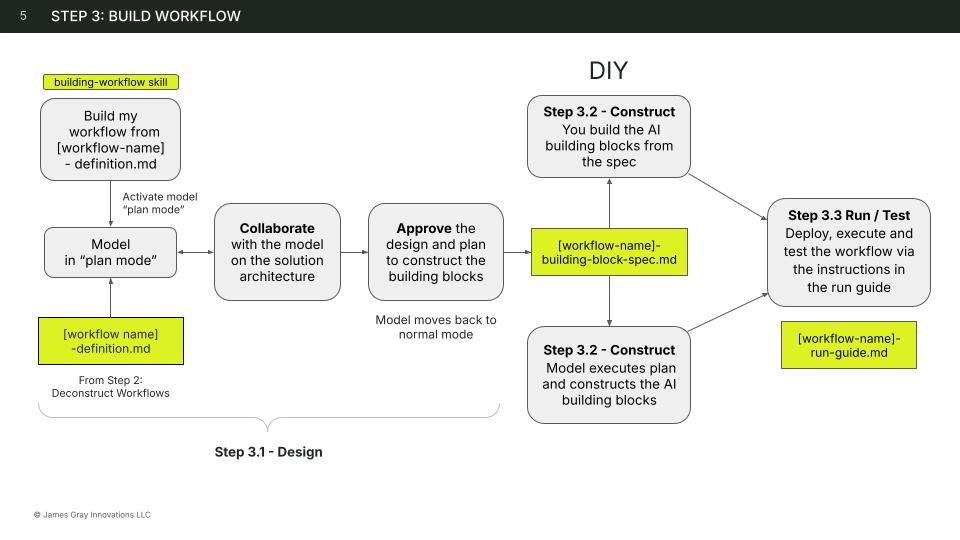

# Step 3: Build AI-Powered Workflows

## Where You Are

You've just finished [Deconstructing](../deconstruct/index.md) your workflow. You should have:

- **Workflow Definition** (`[name]-definition.md`) — every step in your workflow broken down with decision points, data flows, context needs, and failure modes

This file is your input. Build has three parts:

- **3.1: Design** — decide how the workflow should be built
- **3.2: Construct** — build the components
- **3.3: Run** — launch and operate the workflow



## 3.1: Design

Before building anything, decide *how* the workflow should be built. The Design phase takes your Workflow Definition and produces an **AI Building Block Spec** — a complete blueprint that tells you exactly what to build.

Design covers:

1. **Architecture approach** — Choose between **no-code** (build in a platform UI) and **code-first** (build with APIs and SDKs). The model recommends based on signals like integration needs, deployment requirements, and technical comfort. This choice shapes which tools and building blocks are available in subsequent steps.

2. **Architecture decisions** — The model confirms your platform (the one thing not in the Workflow Definition), then extracts tool integrations, trigger/schedule, and browser access flags directly from the definition. It presents a single confirmation block with the platform, integration mapping, and trigger implications — you review and adjust. These gate all subsequent recommendations.

3. **Execution pattern** — Choose from four patterns based on what your workflow needs:

    | Pattern | When to use |
    |---------|-------------|
    | **Prompt** | Sequential steps, human drives the process and provides all inputs |
    | **Skill-Powered Prompt** | Steps with repeatable sub-routines or moderate complexity |
    | **Single Agent** | Tool use required, autonomous decisions, multi-step reasoning |
    | **Multi-Agent** | Multiple expertise domains, parallel execution, review gates |

4. **Interaction mode** — Interactive (real-time collaboration), Autonomous (unattended execution), or Hybrid (mix of both) — determined by your architecture decisions
5. **Autonomy classification** — Classify each step (Human → Deterministic → Semi-Autonomous → Autonomous)
6. **Building block mapping** — Map each step to AI building blocks (Prompt, Context, Skill, Agent, MCP, Project, API, SDK)
7. **Skill candidates** — Tag steps that should become reusable skills, with generation-ready detail
8. **Agent blueprints** (when applicable) — Platform-agnostic specification for each agent (name, description, instructions, model, tools, context, goal) — built into working agents by the model in 3.2

**[Design Your AI Workflow](design.md)** — the full Design guide with execution pattern decision flow and output format

**Produces:** `[name]-building-block-spec.md` — your AI Building Block Spec with architecture approach, architecture decisions, execution pattern with interaction mode, step classifications, skill candidates, agent blueprints (when applicable), code-first selections (when applicable), and implementation order.

## 3.2: Construct

The AI Building Block Spec tells you exactly what to build — and the execution pattern determines which steps you follow. The model uses your architecture decisions (platform, integrations) and resolves deferred decisions (specific platform offering, shareability, code comfort) to generate artifacts in the right format for your specific setup. Work through **only** the steps that apply to your pattern:

=== "Prompt"

    1. **Create context** — Build the context artifacts listed in your Building Block Spec's Context Inventory
    2. **Set up project workspace** (optional) — If the Building Block Spec's Where to Run recommends a project
    3. **Generate platform artifacts** — The model generates the prompt and any configuration needed for your platform
    4. **Run Guide** → 3.3

=== "Skill-Powered Prompt"

    1. **Create context** — Build the context artifacts listed in your Building Block Spec's Context Inventory
    2. **Set up project workspace** (optional) — If the Building Block Spec's Where to Run recommends a project
    3. **Build skills** — Build skills for the steps tagged as skill candidates in your Building Block Spec. The model generates skills in the format appropriate to your platform.
    4. **Generate platform artifacts** — The model generates the prompt and skill configurations for your platform
    5. **Run Guide** → 3.3

=== "Single Agent"

    1. **Create context** — Build the context artifacts listed in your Building Block Spec's Context Inventory
    2. **Build skills** — Build skills for tagged candidates
    3. **Connect tools** — Wire external tools from the Tools and Connectors section of your Building Block Spec
    4. **Generate platform artifacts** — The model generates agent configs, skills, and connectors for your platform
    5. **Run Guide** → 3.3

=== "Multi-Agent"

    1. **Create context** — Build the context artifacts listed in your Building Block Spec's Context Inventory
    2. **Build skills** — Build skills for tagged candidates
    3. **Connect tools** — Wire external tools from the Tools and Connectors section of your Building Block Spec
    4. **Generate platform artifacts** — The model generates agent configs, orchestrator, skills, and connectors for your platform
    5. **Run Guide** → 3.3

The model handles each step based on your execution pattern. See [Construct](construct.md) for details on what you'll need to do yourself (gathering context, configuring MCP connections, building agents on your platform).

## 3.3: Run

The final Construct deliverable is a **Run Guide** (`[name]-run-guide.md`) — a plain-language walkthrough tailored to your platform, architecture approach, and technical comfort level. It tells you exactly what to do with the artifacts that were built:

1. **What was built** — Every artifact listed with what it does and where it lives
2. **Setup steps** — Numbered instructions for getting each artifact into the right place on your platform (menu paths, button names, what you should see when it's working)
3. **First run** — A guided test with sample input, expected behavior, and common first-run issues
4. **What to do next** — How to run it again, share with teammates, and when to revisit

The Run Guide is saved to `[name]-run-guide.md` so you can reference it later or share it with your team.

**The first run is a test, not a final product.** Expect to run, evaluate, go back to 3.2 Construct to adjust, and run again. This cycle is normal — most workflows need 2-4 iterations before they produce reliably good output.

You're evaluating: Did the output match what you expected? Were any steps skipped? Was the output specific to your business, or generic?

**[Run guide](run.md)** — how to choose between a normal chat and a project, and how to troubleshoot first-run issues

### Test, iterate, repeat

Each time you run, you're testing. When something is off, go back to 3.2 Construct, adjust the relevant building block, and run again:

| What went wrong | Go back to 3.2 and... |
|---|---|
| Output is generic or off-brand | Add more **context** — examples, style guides, reference materials |
| Steps were skipped or misunderstood | Refine the **prompt** — make the instructions more explicit |
| A step needs expertise the AI doesn't have | Build a **skill** for that step — codify the expertise |
| The AI needs to make decisions you can't predict | Convert from prompt to **agent** — let the AI plan its approach |

The workflow is ready when you can run it on a new scenario and trust the output without heavy editing. Until then, keep iterating.

**[Run guide > Iterating](run.md#test-iterate-repeat)** — detailed troubleshooting for common first-run issues

---

**Your deliverables across Build:**

| File | From | What it is |
|------|------|-----------|
| `[name]-definition.md` | Deconstruct | Your Workflow Definition — the raw decomposition |
| `[name]-building-block-spec.md` | Build: 3.1 Design | Your AI Building Block Spec — architecture approach, architecture decisions, execution pattern, classifications, skill candidates, agent blueprints, code-first selections |
| Platform artifacts | Build: 3.2 Construct | Prompts, skills, agents, and configs generated in whatever format your platform needs |
| `[name]-run-guide.md` | Build: 3.3 Run | Step-by-step setup instructions, first-run test, and next steps — tailored to your platform |

The Building Block Spec is the design document — it captures *what* to build and *why*. The platform artifacts are the implementation — generated by the model using your architecture decisions and current platform knowledge. The Run Guide bridges the gap between "artifacts exist" and "workflow is running."

Plus any context artifacts and tool connections you set up along the way.

Many workflows stay at the prompt-plus-context level permanently — pasted into a chat whenever you need it. That's a feature, not a limitation.

## Track and Version Your Work

As you build, two background practices keep your work organized and recoverable:

**Register building blocks in your AI Registry.** Each time you create a skill, prompt, or agent, register it in your [AI Registry](../../use-the-cookbook/build/ai-registry.md) Notion database — name, type, description, and which workflow it belongs to. If you registered the workflow during Deconstruct, these building blocks link back to it. This gives you a searchable inventory of everything you've built, and makes it easy for your team to discover and reuse building blocks across workflows.

**Commit source files to GitHub.** The `.md` files for your skills, agents, and prompts are source code — they should live in version control, not just on your local machine. After creating or updating a building block, commit it to your GitHub repository. This gives you a history of changes, makes it easy to share with collaborators, and protects against losing work.

These aren't separate steps — they're part of the rhythm of building. Each time you finish a building block in 3.2 Construct: **test it, register it, commit it.**

!!! tip "Need to set up these tools?"
    The [Builder Stack Setup](../../builder-setup/index.md) guide walks you through everything you need — an AI code editor ([Step 2](../../builder-setup/editor-setup.md)), Git ([Step 3](../../builder-setup/git-install.md)), GitHub ([Step 4](../../builder-setup/github-setup.md)), and the AI Registry ([Step 6](../../builder-setup/notion-registry-setup.md)). If you haven't set these up yet, that guide has you covered.

## Quick Reference

| | Guide | When to use |
|-------|-------|-------------|
| 3.1 | [Design Your AI Workflow](design.md) | Always — produces your AI Building Block Spec |
| 3.2 | [Construct](construct.md) | Always — the model builds your building blocks, with your help on context, MCP, and platform agents |
| 3.3 | [Run](run.md) | Always — Run Guide + iterating |

For deep dives on individual building blocks, see the [Agentic Building Blocks](../../agentic-building-blocks/index.md) reference pages.

## Worked Examples

These three examples show complete AI-powered workflows at different levels of the autonomy spectrum — from deterministic automation to collaborative workflows to fully autonomous multi-agent pipelines. Each includes working building blocks you can install and study.

| Type | AI Involvement | When to Use | Example |
|------|---------------|-------------|---------|
| [Deterministic Automation](deterministic-automation.md) | AI follows fixed rules — criteria from input, output from template | Prospecting, recurring reports, template-driven research | LinkedIn prospect research |
| [AI Collaborative](ai-collaborative.md) | AI researches and drafts; human steers and decides | Meeting prep, competitive analysis, proposal drafting | Meeting prep researcher |
| [Autonomous Agent](autonomous-agent.md) | Multiple agents execute a full pipeline; human reviews at one gate | Research-driven content, multi-step pipelines, specialist roles | HBR article pipeline |

### All Building Blocks

These are the working building blocks included across all three examples. Each one links to its source on GitHub — read the full definition, understand how it works, and adapt it for your own workflows.

| Building Block | Type | Workflow | Description | Source |
|-------|------|----------|-------------|--------|
| `linkedin-prospect-research` | Prompt | Deterministic | Finds and qualifies 5 LinkedIn prospects against a buyer persona | [View](https://github.com/jamesgray-ai/handsonai-plugins/blob/main/plugins/business-first-ai/prompts/linkedin-prospect-research.md) |
| `buyer-persona-revenue-leader-rachel` | Prompt | Deterministic | Example buyer persona used as input to the research workflow | [View](https://github.com/jamesgray-ai/handsonai-plugins/blob/main/plugins/business-first-ai/prompts/buyer-persona-revenue-leader-rachel.md) |
| `meeting-prep-researcher` | Agent | Collaborative | Researches attendees and companies for meeting prep | [View](https://github.com/jamesgray-ai/handsonai-plugins/blob/main/plugins/business-first-ai/agents/meeting-prep-researcher.md) |
| `preparing-meeting-briefs` | Skill | Collaborative | Step-by-step research workflow for the agent | [View](https://github.com/jamesgray-ai/handsonai-plugins/tree/main/plugins/business-first-ai/skills/preparing-meeting-briefs/) |
| `meeting-prep-quick` | Prompt | Collaborative | Portable one-shot meeting prep prompt | [View](https://github.com/jamesgray-ai/handsonai-plugins/blob/main/plugins/business-first-ai/prompts/meeting-prep-quick.md) |
| `ai-productivity-researcher` | Agent | Autonomous | Finds case studies of companies using AI with quantified outcomes | [View](https://github.com/jamesgray-ai/handsonai-plugins/blob/main/plugins/business-first-ai/agents/ai-productivity-researcher.md) |
| `tech-executive-writer` | Agent | Autonomous | Writes articles for business leadership audiences | [View](https://github.com/jamesgray-ai/handsonai-plugins/blob/main/plugins/business-first-ai/agents/tech-executive-writer.md) |
| `hbr-editor` | Agent | Autonomous | Edits drafts against HBR editorial standards | [View](https://github.com/jamesgray-ai/handsonai-plugins/blob/main/plugins/business-first-ai/agents/hbr-editor.md) |
| `editing-hbr-articles` | Skill | Autonomous | Editorial criteria and cut/replace patterns for the editor | [View](https://github.com/jamesgray-ai/handsonai-plugins/tree/main/plugins/business-first-ai/skills/editing-hbr-articles/) |
| `hbr-publisher` | Agent | Autonomous | Formats approved articles as PDF + markdown with SEO metadata | [View](https://github.com/jamesgray-ai/handsonai-plugins/blob/main/plugins/business-first-ai/agents/hbr-publisher.md) |

## How to Use These Examples

=== "Any AI Tool"

    Every example includes at least one **standalone prompt** — a text template you can copy and paste into Claude, ChatGPT, Gemini, M365 Copilot, or any other AI tool. Click the "View" links in the table above to read the prompt source on GitHub.

    Prompts are the most portable building block type. They work everywhere, require no setup, and can be shared with anyone on your team.

=== "Claude Code"

    All building blocks — agents, skills, and prompts — are bundled in the `business-first-ai` plugin. Install it once and the agents activate automatically when you describe a matching task.

    ```bash
    # Add the Hands-on AI marketplace (one time)
    /plugin marketplace add jamesgray-ai/handsonai-plugins

    # Install the business-first-ai plugin
    /plugin install business-first-ai@handsonai
    ```

    Then describe what you need in natural language:

    - *"Run the LinkedIn prospect research workflow using the Revenue Leader Rachel persona"* — executes the deterministic prospecting workflow
    - *"Prepare me for my meeting with Sarah Chen at Acme Corp"* — activates the meeting prep researcher agent
    - *"Write an HBR-style article about companies successfully using AI agents"* — triggers the full multi-agent research → write → edit → publish pipeline

## Related

- [AI Use Cases](../../use-cases/index.md) — browse use cases by type (content creation, research, coding, data analysis, ideation, automation)
- [Analyze AI Workflow Opportunities](../analyze.md) — identify which of your workflows are candidates for AI
- [Deconstruct Workflows](../deconstruct/index.md) — break down workflows into structured definitions
- [Agents & Skills](../../use-the-cookbook/build/index.md) — browse all available agents, skills, and prompts
