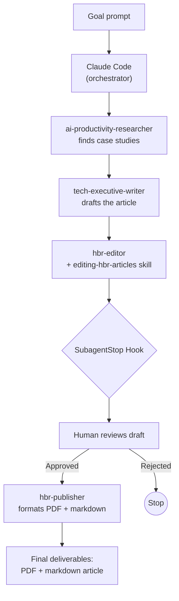

# Autonomous Agent

> **AI involvement:** Multiple specialized agents execute a full pipeline — research, write, edit, review, publish — with human approval at one gate.

## What This Workflow Type Is

An autonomous agent workflow is one where AI handles the entire process — from research to final deliverable — with minimal human intervention. In this example, it goes further: multiple specialized agents each handle one phase of the pipeline, coordinated by Claude Code. The human sets the goal and reviews the draft at one checkpoint. Everything else runs autonomously.

!!! info "At a Glance"
    - **AI involvement:** Full — multiple agents plan, research, write, edit, and publish
    - **Human oversight:** One review gate between editing and publishing
    - **Best for:** Research-driven content production, multi-step pipelines with specialist roles
    - **Complexity:** High — multi-agent orchestration with a skill, a hook, and tool use

### Characteristics

- **Multi-agent** — different agents handle different phases, each with domain expertise
- **Pipeline-structured** — output from one agent becomes input to the next
- **Skill-enhanced** — the editor agent loads the `editing-hbr-articles` skill to apply codified editorial standards during its editing pass
- **Self-reviewing** — the editor agent applies quality criteria from that skill before the human sees the draft
- **Gate-controlled** — a SubagentStop hook pauses execution for human review before publishing
- **End-to-end** — produces a finished deliverable (PDF + markdown) from a single goal statement

### When to Use

Use autonomous agent workflows when the task:

- Requires multiple distinct capabilities (research, writing, editing, formatting)
- Follows a pipeline where each phase has clear inputs and outputs
- Benefits from specialist expertise at each stage
- Produces a deliverable that should meet professional standards
- Can include a human review gate without breaking the flow

## Example Scenario

**The problem:** A business leader wants to publish an HBR-style article about companies successfully using AI agents. The process requires deep research (finding real case studies with quantified outcomes), executive-level writing (translating technical concepts for business audiences), rigorous editing (applying HBR editorial standards), and professional publishing (PDF formatting with SEO metadata). Doing this manually involves multiple skill sets and takes days of focused work.

**The solution:** A multi-agent pipeline in Claude Code. One prompt triggers a chain of specialized agents — a researcher finds case studies, a writer produces the article, an editor applies HBR standards, the human reviews the draft, and a publisher formats the final deliverable. Each agent brings domain expertise that would otherwise require a different person.

### The Goal Prompt

This single prompt triggers the entire pipeline:

> *"Please write an analysis and Harvard Business Review-style article on successful companies that you can find by doing research that have successfully used and applied AI agents to their business. This article is for a business leadership audience, and I'd like to have the final deliverable as a PDF, and markdown file."*

## Building Blocks

All building blocks are already included in the `course-examples` plugin — no additional installation required.

| Building Block | Type | Role in Pipeline | Source |
|-------|------|-----------------|--------|
| `ai-productivity-researcher` | Agent | Finds documented case studies of companies using AI with quantified outcomes | [View on GitHub](https://github.com/jamesgray-ai/handsonai/blob/main/plugins/course-examples/agents/ai-productivity-researcher.md) |
| `tech-executive-writer` | Agent | Writes the article for a business leadership audience | [View on GitHub](https://github.com/jamesgray-ai/handsonai/blob/main/plugins/course-examples/agents/tech-executive-writer.md) |
| `hbr-editor` | Agent | Edits the draft against HBR editorial standards | [View on GitHub](https://github.com/jamesgray-ai/handsonai/blob/main/plugins/course-examples/agents/hbr-editor.md) |
| `editing-hbr-articles` | Skill | Provides editorial criteria and cut/replace patterns for the editor | [View on GitHub](https://github.com/jamesgray-ai/handsonai/tree/main/plugins/course-examples/skills/editing-hbr-articles/) |
| `hbr-publisher` | Agent | Formats the approved article as PDF and markdown with SEO metadata | [View on GitHub](https://github.com/jamesgray-ai/handsonai/blob/main/plugins/course-examples/agents/hbr-publisher.md) |

## How It Works



**Step-by-step:**

1. **User provides the goal** — a single prompt describing the article topic, audience, and desired deliverables.
2. **`ai-productivity-researcher` runs** — searches news outlets, business publications, and analyst reports for documented case studies of companies using AI agents. Prioritizes HBR-caliber sources with quantified outcomes (revenue impact, productivity gains, cost savings).
3. **`tech-executive-writer` runs** — takes the research output and produces a full-length article. Translates technical AI concepts for a non-technical business audience. Structures the piece with a compelling narrative, specific examples, and executive-level insights.
4. **`hbr-editor` runs** — reads the `editing-hbr-articles` skill to load editorial criteria, then edits the draft. Checks structure (does the opening hook?), evidence quality (are claims supported by named companies and data?), voice (active, no hedging), and length (2,500-3,500 words for features). Makes direct, prescriptive edits.
5. **SubagentStop hook fires** — pauses the pipeline and presents the edited draft to the human for review.
6. **Human reviews** — reads the edited article and either approves it to continue or stops the pipeline for manual revision.
7. **`hbr-publisher` runs** (on approval) — formats the article for web publication (SEO metadata, social snippets) and generates a professional PDF. Produces two files: a markdown version and a PDF.

## The Pipeline in Detail

| Phase | Agent/Component | Input | Output | What Makes It Autonomous |
|-------|----------------|-------|--------|--------------------------|
| Research | `ai-productivity-researcher` | Goal prompt | Structured case study briefs | Agent decides which sources to search and which cases meet the quality bar |
| Writing | `tech-executive-writer` | Research briefs | Full article draft | Agent structures the narrative, chooses which cases to feature, and adapts tone for the audience |
| Editing | `hbr-editor` + skill | Article draft | Edited draft with tracked changes | Agent applies codified editorial criteria — not subjective taste, but documented standards |
| Review gate | SubagentStop hook | Edited draft | Human approval or rejection | Pipeline pauses automatically — human decides quality, not the AI |
| Publishing | `hbr-publisher` | Approved draft | PDF + markdown files | Agent handles formatting, metadata, and layout without human input |

### Why Multiple Agents Instead of One?

Each agent is a specialist. The researcher knows where to find credible business case studies. The writer knows how to structure executive-level content. The editor knows HBR's specific editorial standards (loaded from a skill file with reference criteria). The publisher knows formatting and SEO.

A single generalist prompt could attempt all of this, but the output quality degrades because no single prompt can encode deep expertise across research methodology, executive writing style, editorial standards, and publication formatting. Splitting into specialists lets each agent focus on what it does best.

### The Human Review Gate

The SubagentStop hook is critical. It fires after the editor finishes and before the publisher starts, giving the human a chance to:

- **Approve** — the article meets standards, continue to publishing
- **Reject** — the article needs changes the AI can't make (factual corrections, strategic adjustments, tone shifts)

This is a deliberate design choice. The pipeline is autonomous enough to produce a near-final draft without human involvement, but publishing is a high-stakes action — once an article goes out, it represents the author. The gate ensures a human makes that call.

## Usage

=== "Claude Code (Plugin)"

    All five agents and the editing skill are included in the `course-examples` plugin.

    ```bash
    # Install the plugin (one time)
    /plugin install course-examples@handsonai
    ```

    Then provide the goal prompt:

    > "Please write an analysis and Harvard Business Review-style article on successful companies that you can find by doing research that have successfully used and applied AI agents to their business. This article is for a business leadership audience, and I'd like to have the final deliverable as a PDF, and markdown file."

    Claude Code orchestrates the full pipeline automatically. You'll be prompted to review the draft at the human-in-the-loop gate before publishing proceeds.

    !!! tip "Customize the topic"
        Swap the article topic for anything relevant to a business audience. The pipeline structure stays the same — only the research and writing content changes:

        - *"Write an HBR-style article about how mid-market companies are using AI to reduce customer churn"*
        - *"Research and write a thought leadership piece on AI-driven supply chain optimization"*
        - *"Produce a business article analyzing how professional services firms are adopting AI agents"*

=== "Adapting Without Claude Code"

    This pipeline is designed for Claude Code's multi-agent orchestration. Without it, you can still replicate the workflow manually by running each phase as a separate conversation:

    1. **Research phase** — In any AI tool with web search, prompt: *"Find 5-7 documented case studies of companies successfully using AI agents, with quantified business outcomes. Prioritize sources from HBR, McKinsey, Forrester, or major business publications."*
    2. **Writing phase** — In a new conversation, paste the research output and prompt: *"Write a 2,500-3,500 word article for a business leadership audience about these companies' AI agent implementations. Use an HBR editorial style."*
    3. **Editing phase** — In a new conversation, paste the draft and prompt: *"Edit this article to HBR publication standards. Focus on: opening hook, evidence quality, active voice, and cutting redundancy."*
    4. **Review** — Read the edited draft yourself.
    5. **Publishing** — Format manually or use your preferred publishing tools.

    The manual approach works but loses the seamless handoff between agents, the codified editorial standards from the skill file, and the automatic human review gate.

## Adapting This Example

The HBR article pipeline is one application, but the multi-agent orchestration pattern applies to any workflow where different phases require different expertise:

- **Client deliverable pipeline** — researcher gathers data → analyst produces insights → writer creates the report → reviewer checks quality → designer formats the final document
- **Sales proposal generation** — researcher profiles the prospect → writer drafts the proposal → pricing specialist adds numbers → reviewer ensures accuracy → formatter produces the PDF
- **Course content creation** — researcher gathers source material → instructional designer structures the lesson → writer creates slides and exercises → editor reviews for clarity → publisher formats for the LMS
- **Competitive intelligence reports** — scanner monitors competitor channels → analyst identifies key changes → writer summarizes findings → editor ensures accuracy → distributor sends to stakeholders

To adapt: identify the distinct phases of your workflow and the specialist expertise each phase requires. If you'd assign different people to different phases in a team setting, those phases are candidates for different agents.

## Related

- [Deterministic Automation Workflow Example](./deterministic-automation.md) — when AI follows fixed rules with no judgment needed
- [AI Collaborative Workflow Example](./ai-collaborative.md) — when AI and human iterate together
- [Find AI Workflow Opportunities](../prompting/ai-workflow-opportunity-finder.md) — discover which workflows are candidates for autonomous agents
- [Deconstruct Workflows into AI Building Blocks](../prompting/workflow-deconstruction-meta-prompt.md) — break down workflows into agent-ready steps
- [Plugin Marketplace](../../plugins/index.md) — browse all agents and skills used in this pipeline
