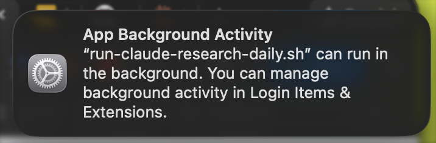
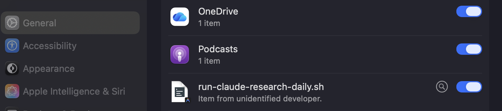

# Scheduling Claude Code Subagents

Set up your Claude Code subagents to run automatically on a schedule—like a research assistant that gathers information while you sleep.

**Key concept:** You already have a subagent defined. Now you're telling Claude Code to run it on a schedule. Claude Code creates all the configuration files and activates it for you.

**Official docs:** [Claude Code CLI Reference](https://code.claude.com/docs/en/cli-reference)

## Prerequisites

- Claude Code installed and authenticated (see [Claude Code Setup Guide](../../../fundamentals/developer-setup/claude-code-install.md))
- **A subagent already created** with its configuration in a markdown file
- **Windows only:** PowerShell access

## Important: Update Your CLAUDE.md First

**Before scheduling any subagent, you must add scheduling instructions to your project's CLAUDE.md file.** This tells Claude Code how to properly set up scheduled tasks (logging, permissions, etc.).

Add this section to your CLAUDE.md:

=== "macOS"

    ```markdown
    ## Scheduling Subagents

    When setting up scheduled tasks for subagents:
    - Use `claude -p "prompt" --dangerously-skip-permissions` to allow headless tool use (required for agents that write files)
    - Use the full path to claude binary (e.g., `~/.local/bin/claude`) since launchd runs with minimal PATH
    - Always include logging to capture stdout/stderr for troubleshooting
    - Store logs in the project's `logs/scheduled/` folder so they're easy to find
    - Include timestamps in log filenames for easy debugging
    ```

=== "Windows"

    ```markdown
    ## Scheduling Subagents

    When setting up scheduled tasks for subagents:
    - Use `claude -p "prompt" --dangerously-skip-permissions` to allow headless tool use (required for agents that write files)
    - Use the full path to claude binary (e.g., `%LOCALAPPDATA%\Programs\claude-code\claude.exe`) since Task Scheduler runs with minimal PATH
    - Always include logging to capture stdout/stderr for troubleshooting
    - Store logs in the project's `logs/scheduled/` folder so they're easy to find
    - Include timestamps in log filenames for easy debugging

    ### Windows-specific
    - **Always write PowerShell to `.ps1` files** rather than running inline commands - `$` variables get stripped when passing PowerShell through Git Bash
    - Create a runner script (e.g., `scripts/run-<agent-name>.ps1`) and a setup script (e.g., `scripts/setup-<agent-name>-schedule.ps1`)
    - Use `Register-ScheduledTask` in the setup script to register with Task Scheduler
    ```

**Why is this necessary?** Without these instructions, Claude Code won't know to use the special flags needed for scheduled (headless) operation, and your subagent will fail silently.

Your project's CLAUDE.md should include these instructions.

## Example: Scheduling the "claude-research-daily" Subagent

This repo includes a working example subagent called `claude-research-daily` that researches the latest Claude and Anthropic news. You can find it at:

```
.claude/agents/claude-research-daily.md
```

Let's schedule it to run automatically every weekday morning.

### Step 1: Ask Claude Code to Schedule Your Subagent

Open Claude Code in this repo folder, then use a prompt like this:

=== "macOS"

    ```
    Schedule my claude-research-daily subagent to run every weekday at 7:30 AM on macOS.
    ```

=== "Windows"

    ```
    Schedule my claude-research-daily subagent to run every weekday at 7:30 AM on Windows.
    ```

Claude Code will automatically set up logging based on the instructions in your CLAUDE.md file.

### Step 2: Claude Code Sets Everything Up

Claude Code will create everything for you:

=== "macOS"

    1. **`scripts/` folder** - Contains the wrapper script for your subagent
    2. **Wrapper script** - Customized with your project's paths
    3. **Schedule configuration** - Tells macOS when to run it
    4. **Logs folder** - For troubleshooting

=== "Windows"

    1. **`scripts/` folder** - Contains the PowerShell script for your subagent
    2. **PowerShell script** - Customized with your project's paths
    3. **Scheduled task** - Registered in Task Scheduler
    4. **Logs folder** - For troubleshooting

You don't need to create or edit any files yourself—Claude Code handles all of it and uses the correct paths for your machine.

### Step 3: Test It

Ask Claude Code to run the subagent now to make sure everything works:

```
Run my claude-research-daily subagent now so I can test it.
```

Then check that your research file was created:

```
Show me the output from claude-research-daily.
```

You should see a file in the `outputs/` folder like `claude-research-daily-2026-01-27.md`.

## Common Scheduling Patterns

Here are typical schedules for different types of subagents:

| Subagent Type | Suggested Schedule | Example Prompt |
|---------------|-------------------|----------------|
| Daily news/research | Weekdays at 7-8 AM | "Run every weekday at 7:30 AM" |
| Competitor monitoring | Weekly on Monday | "Run every Monday at 8:00 AM" |
| Weekly summaries | Friday afternoon | "Run every Friday at 4:00 PM" |
| Frequent updates | Every few hours | "Run every 4 hours during business hours" |

### Example: Scheduling a Weekly Subagent

```
Schedule my competitor-watch subagent to run every Monday at 8:00 AM.
```

## Managing Your Subagents

Ask Claude Code to manage your subagents—no need to memorize commands.

| What you want | Ask Claude Code |
|---------------|-----------------|
| See your subagents | "What scheduled subagents do I have running?" |
| Pause a subagent | "Pause my claude-research-daily subagent" |
| Resume a subagent | "Resume my claude-research-daily subagent" |
| Change the schedule | "Change claude-research-daily to run at 6:00 AM instead" |
| Update the goal | "Update claude-research-daily to also include robotics news" |
| Remove a subagent | "Remove my claude-research-daily subagent schedule completely" |
| Check status | "Is my claude-research-daily subagent running properly?" |
| View logs | "Show me the logs from claude-research-daily's last run" |

### Example: Updating Your Subagent's Schedule

```
Change my claude-research-daily subagent to run at 6:00 AM instead of 7:30 AM.
```

Claude Code will update the configuration and reload it for you.

## Quick Troubleshooting

**Subagent not running?**

Ask Claude Code: "Check if my claude-research-daily subagent is working and tell me what's wrong."

**No output file created?**

Ask Claude Code: "My claude-research-daily ran but I don't see an output file. What happened?"

**Want to see what happened?**

Ask Claude Code: "Show me the logs from claude-research-daily's last run."

For more detailed troubleshooting, see [Scheduled Subagent Troubleshooting](./scheduling-subagent-issues.md).

## How It Works (Behind the Scenes)

=== "macOS"

    When Claude Code schedules a subagent on macOS, it uses **launchd**—the built-in macOS scheduling system. Claude Code creates:

    1. **Wrapper script** - Runs your subagent with proper logging
    2. **Plist file** - Tells macOS when to run the script

    The wrapper script uses special flags for headless operation:
    - `--dangerously-skip-permissions` - Allows the agent to use tools (like writing files) without prompting for confirmation
    - Full path to claude binary - Since launchd runs with minimal PATH

    The nice thing about launchd: if your Mac is asleep at the scheduled time, it runs the subagent when your Mac wakes up. So your 7:30 AM research digest still gets created even if your Mac was closed.

=== "Windows"

    When Claude Code schedules a subagent on Windows, it uses **Task Scheduler**—the built-in Windows scheduling system. Claude Code creates:

    1. **PowerShell script** - Runs your subagent with proper logging
    2. **Scheduled task** - Tells Windows when to run the script

    The PowerShell script uses special flags for headless operation:
    - `--dangerously-skip-permissions` - Allows the agent to use tools (like writing files) without prompting for confirmation
    - Full path to claude binary - Since Task Scheduler runs with minimal PATH

    **Important PowerShell details:**

    - **Always write PowerShell to `.ps1` files** rather than running inline commands—`$` variables get stripped when passing PowerShell through Git Bash
    - Claude Code creates a **runner script** (e.g., `scripts/run-<agent-name>.ps1`) and a **setup script** (e.g., `scripts/setup-<agent-name>-schedule.ps1`)
    - The setup script uses `Register-ScheduledTask` to register with Task Scheduler

    You can see your scheduled subagents in Task Scheduler if you're curious (press `Win + R`, type `taskschd.msc`), but you don't need to—Claude Code can manage everything for you.

!!! note "macOS: Background Activity Notification"

    The first time your scheduled subagent runs, macOS will show a notification about background activity.

    **This is normal and expected.** It's macOS letting you know a new scheduled task is running.

    If you click the notification, you'll see the **Login Items & Extensions** panel in System Settings. Your script will appear in the list:

    

    

    **Important:**

    - Keep the toggle **ON** (blue) — this allows your scheduled task to run
    - "Unidentified developer" is normal — it's your own script, not from the App Store
    - If you turn it **OFF**, your scheduled subagent will stop running

    **If you accidentally turned it off:**

    1. Open **System Settings** (click Apple menu  → System Settings)
    2. Click **General** in the left sidebar
    3. Click **Login Items & Extensions**
    4. Scroll down to the **App Background Activity** section
    5. Find your script (e.g., `run-claude-research-daily.sh`)
    6. Toggle it back **ON**

## Next Steps

- Try scheduling the `claude-research-daily` subagent using the example above
- Test it manually before relying on the schedule
- Check the `outputs/` folder the next morning for your research digest
- Create your own subagents and schedule them the same way
