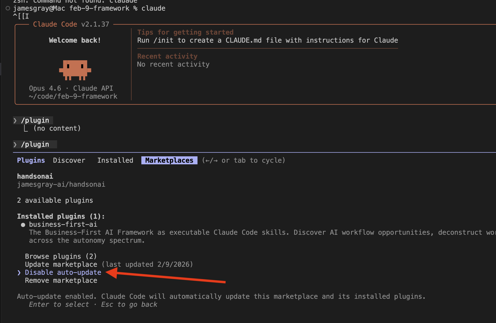

# Getting Started with Plugins

Plugins give Claude domain expertise — writing standards, naming conventions, research processes — that it applies automatically. This guide walks you through installing your first plugin in three steps.

Not sure what plugins are? Read the [Plugin Marketplace overview](index.md#why-plugins) first.

## Prerequisites

- **Claude Code** installed and working ([Installation Guide](../builder-setup/claude-code-install.md))
- An active **Claude Pro, Max, Team, or Enterprise** subscription (plugins are not available on the free plan)

## Step 1: Add the Marketplace

A marketplace is a collection of plugins hosted online. Adding it tells Claude Code where to find plugins you can install. You only need to add it once.

In your Claude Code session, type:

```bash
/plugin marketplace add jamesgray-ai/handsonai
```

This tells Claude Code where to find the Hands-on AI plugins. It does not install anything yet. For more on how marketplaces work, see the official [Discover and install plugins](https://code.claude.com/docs/en/discover-plugins) guide.

!!! tip
    You can see which marketplaces you've added with `/plugin marketplace list`.

## Step 2: Install a Plugin

Browse the [Plugin Marketplace](index.md) to find a plugin that matches your workflow. Each plugin lists the agents and skills it includes.

To install a plugin, type the install command shown on the marketplace page in your Claude Code session:

```bash
/plugin install <plugin-name>@handsonai
```

For example:

```bash
/plugin install business-first-ai@handsonai
```

After installing, the plugin's agents and skills are available in your Claude Code session. Installed plugins are stored in `~/.claude/plugins/` on your machine.

!!! tip
    You can install as many plugins as you like. They don't conflict with each other.

## Step 3: Use Plugin Commands

Installed plugins add agents and skills that Claude Code can use automatically. You don't need to call them by name — just describe what you need and Claude will use the right agent or skill.

**Example prompts:**

- "Write a LinkedIn post about how RAG is transforming enterprise search"
- "What's new in AI today?"
- "Write an SOP for the Email Response Drafting workflow"

Each plugin on the [marketplace page](index.md) includes a recommended workflow and example prompts so you know exactly what to ask.

!!! tip "Want to use plugins outside Claude Code?"
    Skills from plugins also work in Claude.ai, Claude Cowork, and the Claude API. See [Using Plugins](using-plugins.md) for setup instructions on every platform.

## Updating Plugins

When a plugin is updated with new agents, skills, or improvements, pull the latest version:

```bash
/plugin update <plugin-name>@handsonai
```

Or update all installed plugins at once:

```bash
/plugin update --all
```

## Enabling Auto-Updates

By default, Claude Code only auto-updates **official Anthropic marketplaces**. Third-party marketplaces like Hands-on AI have auto-updates disabled, so you won't receive new agents, skills, or fixes automatically.

To enable auto-updates for the Hands-on AI marketplace:

1. Run `/plugin` to open the plugin manager
2. Select the **Marketplaces** tab
3. Choose **handsonai** from the list
4. Select **Enable auto-update**



Once enabled, Claude Code refreshes the marketplace and updates installed plugins each time it starts. If any plugins were updated, you'll see a notification suggesting you restart Claude Code.

!!! tip
    You can still update manually at any time with `/plugin update --all` — auto-update just makes it happen automatically at startup.

For more details on auto-update behavior and environment variables, see the official [Configure auto-updates](https://code.claude.com/docs/en/discover-plugins#configure-auto-updates) documentation.

## Uninstalling

To remove a plugin you no longer need:

```bash
/plugin uninstall <plugin-name>@handsonai
```

To remove the marketplace entirely:

```bash
/plugin marketplace remove handsonai
```

## Troubleshooting

### "Marketplace not found"

Make sure you've added the marketplace first:

```bash
/plugin marketplace add jamesgray-ai/handsonai
```

### "Plugin not found"

Check the plugin name is spelled correctly and includes the `@handsonai` suffix:

```bash
# Correct
/plugin install business-first-ai@handsonai

# Wrong — missing marketplace suffix
/plugin install business-first-ai
```

### "Permission denied" or authentication errors

The marketplace is public. If you see authentication errors, check your GitHub CLI configuration ([GitHub Setup guide](../builder-setup/github-setup.md)).

Run this in your **terminal** (not inside Claude Code):

```bash
gh auth status
```

### Plugin agents not appearing

After installing a plugin, you may need to restart your Claude Code session for the agents and skills to become available.

### Checking installed plugins

List everything you have installed:

```bash
/plugin list
```
