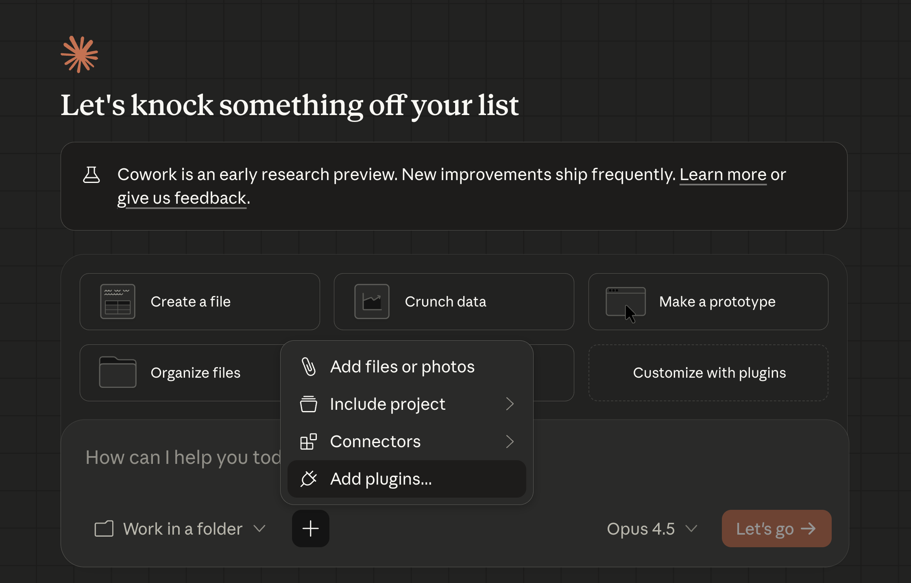

# Using Plugins

You've installed a plugin — now what? This guide explains what plugins give you and how to use them across every Claude surface.

!!! tip "Haven't installed a plugin yet?"
    Start with the [Getting Started guide](getting-started.md) — three quick steps.

## What You Get After Installing a Plugin

Plugins provide two things:

- **Agents** — Expert personalities that Claude activates automatically based on your request. For example, ask for a LinkedIn post and Claude brings in a writing specialist.
- **Skills** — Step-by-step workflows (an instruction file plus optional reference material) that teach Claude how to do specific tasks. For example, a skill might teach Claude your company's naming conventions.

You don't need to memorize agent names or skill commands. Describe what you need and Claude picks the right agent or skill.

## Agents vs Skills

| | Agents | Skills |
|---|--------|--------|
| What they are | Expert personalities (writing style, domain knowledge, process) | Step-by-step workflows with instructions + reference material |
| How they activate | Claude automatically picks the right one based on your request | Automatically when relevant, or type `/plugin-name:skill-name` |
| Where they work | Claude Code only | Claude Code, Claude.ai (upload as ZIP), and Claude Cowork |
| Example | "Write a LinkedIn post about RAG" activates `tech-executive-writer` | "Name a workflow for drafting email responses" loads `naming-workflows` naming conventions |

## Using Plugins in Claude Code

### Agents — just talk naturally

Describe what you need. Claude Code matches your request to the right agent automatically.

**Examples from the `course-examples` plugin:**

```
"Write a LinkedIn post about how RAG is transforming enterprise search"
→ tech-executive-writer activates

"Review this article for HBR quality"
→ hbr-editor activates

"What's new in AI today?"
→ ai-news-researcher activates
```

Claude Code shows which agent it selected at the top of the response. You can list all available agents with `/agents`.

### Skills — natural language or slash commands

Skills activate the same way — describe what you need and the relevant skill loads automatically.

You can also invoke a skill directly with a slash command:

```
/ai-registry:naming-workflows
```

The format is `/plugin-name:skill-name`.

**Examples:**

| Plugin | Slash command | What it does |
|--------|--------------|-------------|
| `ai-registry` | `/ai-registry:naming-workflows` | Generates consistent workflow names and creates Notion entries |
| `ai-registry` | `/ai-registry:writing-workflow-sops` | Writes Standard Operating Procedure docs for workflows |
| `course-examples` | `/course-examples:editing-hbr-articles` | Loads HBR editorial criteria for article editing |

!!! note
    Skills from the `ai-registry` plugin require the [Notion MCP connector](../fundamentals/developer-setup/notion-registry-setup.md) to be configured. Without it, Claude can follow the naming conventions and draft the output, but cannot read from or write to Notion.

### Checking what's installed

```bash
/plugin list
```

This shows all installed plugins with their agents and skills.

## Using Skills in Claude.ai (Web)

Claude.ai supports skills through a ZIP upload process. You can take any plugin skill and use it on the web — no terminal required.

### Prerequisites

- Claude **Pro**, **Max**, **Team**, or **Enterprise** plan
- **Code execution** enabled in Settings > Capabilities (this lets Claude run skills — it does not give Claude access to your computer)

### Upload a plugin skill to Claude.ai

**1. Download the skill folder from GitHub**

Each skill is a folder containing an instruction file (`SKILL.md`) and optional reference material. To download one:

1. [Download the repository ZIP](https://github.com/jamesgray-ai/handsonai/archive/refs/heads/main.zip) (this downloads all plugins at once)
2. Unzip the download and find your skill folder inside `plugins/<plugin-name>/skills/<skill-name>/`

For example, the `editing-hbr-articles` skill is at:

```
plugins/course-examples/skills/editing-hbr-articles/
```

This folder contains `SKILL.md` and a `references/` directory.

**2. Verify the skill name**

Open the `SKILL.md` file in a text editor. Near the top, you'll see a `name:` field — check that it uses only lowercase letters, numbers, and hyphens (e.g., `editing-hbr-articles`).

**3. Zip the skill folder**

Right-click the skill folder (e.g., `editing-hbr-articles`) and compress it into a `.zip` file.

!!! warning "Common mistake"
    Zip the **folder itself**, not the individual files inside it. When you open the ZIP, you should see a single folder (e.g., `editing-hbr-articles/`) — not loose files.

**4. Upload to Claude.ai**

Go to **Settings > Capabilities > Upload skill**. Select your `.zip` file.

**5. Toggle the skill on**

Find your uploaded skill in the Skills list and enable it.

**6. Start using it**

Open a new chat and describe your need. Claude automatically uses the skill when relevant.

### Walkthrough: `editing-hbr-articles` in Claude.ai

Here's a concrete example using the `editing-hbr-articles` skill — the most portable skill in the marketplace since it has no external dependencies:

1. [Download the repository ZIP](https://github.com/jamesgray-ai/handsonai/archive/refs/heads/main.zip) and extract it
2. Find the folder `plugins/course-examples/skills/editing-hbr-articles/` — it contains `SKILL.md` and `references/editorial-criteria.md`
3. Right-click the `editing-hbr-articles` folder and compress it to a ZIP
4. In Claude.ai, go to **Settings > Capabilities** and upload the ZIP
5. Toggle the skill on
6. Open a new chat and say: **"Edit this article for HBR quality"** — then paste your draft

Claude applies the editorial criteria from the skill's reference file automatically.

### What about agents in Claude.ai?

In Claude Code, Claude automatically picks the right agent for your request. This automatic selection does not exist in Claude.ai.

Agent files have a different format from skill files and cannot be uploaded as skills directly. For agent-like behavior in Claude.ai, you can:

- Create a **Project** and paste the agent's instructions as custom instructions
- Convert the agent into a skill (wrap its instructions in a `SKILL.md` file)

### Skill compatibility across platforms

Most skills work fully across Claude Code, Claude.ai, Claude Desktop, and Cowork. A few skills require terminal or git access and are limited to Claude Code.

| Skill | Claude Code | Claude.ai | Desktop / Cowork | Notes |
|-------|:----------:|:---------:|:----------------:|-------|
| `editing-hbr-articles` | **Full** | **Full** | **Full** | Pure instructions + reference doc |
| `naming-workflows` | **Full** | **Full** | **Full** | Reads/writes Notion across all platforms |
| `writing-workflow-sops` | **Full** | **Full** | **Full** | Reads/writes Notion across all platforms |
| `writing-process-guides` | **Full** | **Full** | **Full** | Reads/writes Notion across all platforms |
| `registering-skills` | **Full** | **Full** | **Full** | Reads/writes Notion across all platforms |
| `syncing-skills-to-github` | **Full** | No | No | Requires terminal + git access |

## Using Plugins in Claude Cowork

Cowork is a visual workspace inside the Claude Desktop app (macOS) designed for non-technical work — writing, research, analysis, and project coordination. You set the goal and Claude delivers finished, professional work. It's available on Claude Pro, Max, Team, and Enterprise plans.

Cowork has its own **built-in plugin directory**, so you don't need Claude Code or a terminal to use plugins. The directory includes plugins across productivity, marketing, legal, finance, data analysis, and more — browse the full catalog at [claude.com/plugins-for/cowork](https://claude.com/plugins-for/cowork).

### Install a plugin in Cowork

1. Open Claude Desktop and click **Cowork** in the sidebar
2. Click the **+** button at the bottom of the screen (next to "Work in a folder")
3. Select **Add plugins...** from the menu
4. Browse the plugin directory or upload a custom plugin file

You can also click the **Customize with plugins** card on the Cowork home screen to go directly to plugin setup.



### What Cowork offers with plugins

- Plugins bundle skills, connectors, slash commands, and sub-agents
- Cowork coordinates parallel workstreams and delivers professional outputs (Excel, PowerPoint, formatted docs)
- Pairs with **Claude in Chrome** for browser-based tasks
- Pairs with **MCP connectors** for external tool access (e.g., Notion)
- Plugins are saved locally to your machine

### Cowork vs Claude Code

| | Cowork | Claude Code |
|---|--------|------------|
| Interface | Visual — no terminal needed | Terminal-based |
| Plugin discovery | **+** button > **Add plugins...** or [plugin directory](https://claude.com/plugins-for/cowork) | `/plugin install` command |
| Agent activation | Via plugin commands | Auto-routing based on request |
| Best for | Knowledge workers, non-technical users | Developers, coding tasks |
| Plugin format | Same plugin files | Same plugin files |

Both support the same plugin format and skill files. If you're not comfortable with the terminal, Cowork is the recommended path.

## Using Skills via the Claude API

??? advanced "For developers"

    Skills can be used programmatically through the Claude API in two ways.

    ### Skills API

    Upload custom skills via the `/v1/skills` endpoints, then reference them by `skill_id` in conversations:

    ```python
    import anthropic

    client = anthropic.Anthropic()

    # Reference an uploaded skill by ID
    response = client.messages.create(
        model="claude-sonnet-4-20250514",
        max_tokens=4096,
        skill_ids=["sk_editing-hbr-articles"],
        messages=[
            {"role": "user", "content": "Edit this article for HBR quality:\n\n[article text]"}
        ]
    )
    ```

    ### System prompt approach

    Alternatively, embed the content of `SKILL.md` (and any reference files) directly in the `system` parameter:

    ```python
    import anthropic

    client = anthropic.Anthropic()

    # Read SKILL.md content
    with open("editing-hbr-articles/SKILL.md") as f:
        skill_content = f.read()

    with open("editing-hbr-articles/references/editorial-criteria.md") as f:
        criteria = f.read()

    response = client.messages.create(
        model="claude-sonnet-4-20250514",
        max_tokens=4096,
        system=f"{skill_content}\n\n## Reference: Editorial Criteria\n\n{criteria}",
        messages=[
            {"role": "user", "content": "Edit this article for HBR quality:\n\n[article text]"}
        ]
    )
    ```

    !!! note
        MCP-dependent skills (like `registering-skills` or `syncing-skills-to-github`) won't work via the raw API since they require tool integrations that the API alone doesn't provide.

## Platform Summary

| Capability | Claude Code | Claude.ai | Cowork | API |
|------------|:-----------:|:---------:|:------:|:---:|
| Plugin install | `/plugin install` | Upload skills as ZIP | Sidebar plugin browser | Skills API |
| Agent auto-routing | Yes | No | No | No |
| Skills (auto-trigger) | Yes | Yes (after upload) | Yes (via plugin) | Yes (Skills API) |
| Skills (slash command) | `/plugin-name:skill-name` | No | `/` commands | No |
| MCP / Connectors | Yes | Some skills (via MCP) | Yes (connectors) | No |
| Browser automation | No | No | Yes (Chrome) | No |
| Reference file loading | Automatic | Included in ZIP | Automatic (via plugin) | Manual |
| Best for | Developers | Quick skill use, any device | Knowledge work, non-technical users | Programmatic access |

## Troubleshooting

### "I installed a plugin but nothing happens"

Restart your Claude Code session. Then verify the plugin is installed:

```bash
/plugin list
```

If the plugin appears but agents don't activate, try being more explicit in your prompt — for example, "Write a LinkedIn post about AI" rather than just "write something."

### "Skill not working in Claude.ai"

1. Check that **code execution** is enabled in **Settings > Capabilities**
2. Check the [compatibility table](#skill-compatibility-across-platforms) — some skills require MCP connectors that Claude.ai doesn't support
3. Make sure the skill is toggled **on** in your Skills list

### "ZIP upload failed"

- The ZIP must contain a **folder** with `SKILL.md` inside it — not loose files at the root
- The `name` field in `SKILL.md` frontmatter must use only **lowercase letters, numbers, and hyphens**
- The ZIP file should not exceed the upload size limit

### "Can't find skill files to download"

All skills are available on GitHub. Browse the [Plugin Marketplace](index.md) and click any skill name to go directly to its source folder.

Direct URL pattern:

```
https://github.com/jamesgray-ai/handsonai/tree/main/plugins/<plugin-name>/skills/<skill-name>/
```

## Next Steps

- [Getting Started](getting-started.md) — install your first plugin (if you haven't already)
- [Plugin Marketplace](index.md) — browse available plugins and see what each one does
- [Notion Registry setup](../fundamentals/developer-setup/notion-registry-setup.md) — required for `ai-registry` skills that save to Notion
