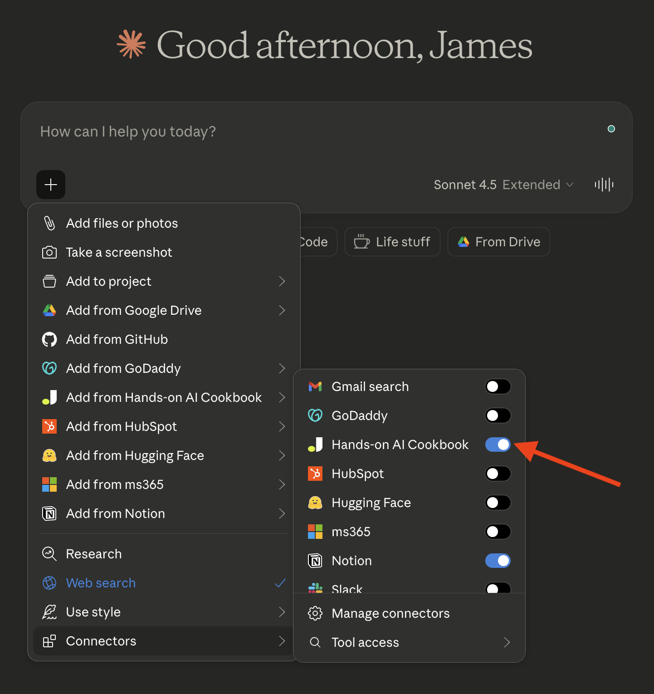

# MCP Server

The Hands-on AI Cookbook is available as an MCP (Model Context Protocol) server, so you can get cookbook-informed answers directly in your AI tools — no API keys or authentication required.

**MCP server URL:** `https://mcp.handsonai.info/mcp`

{ width="600" }

*The Hands-on AI Cookbook connector enabled in Claude. This works in any AI tool that supports MCP — see below for setup instructions for Claude, ChatGPT, Cursor, VS Code, and more.*

## What You Get

The MCP server gives your AI assistant access to:

- **Search** across all cookbook pages by keyword
- **Read** the full content of any page
- **Browse** sections like Building Blocks, Framework, Use Cases, and more
- **Deep dive** into building blocks or framework steps with all sub-pages
- **Q&A lookup** with quick answers from the cookbook's question pages
- **Setup guides** for every tool in the Builder Stack

## Connect from Claude

Claude supports remote MCP servers as custom connectors across all its products. Add the connector once, and it's available in Claude chat, Claude Desktop, and Cowork.

### Claude (claude.ai) and Claude Desktop

1. Go to **Settings** → **Connectors**
2. Scroll to the bottom and click **Add custom connector**
3. Enter the MCP server URL: `https://mcp.handsonai.info/mcp`
4. Click **Add**

To use it in a conversation, click the **+** button in the chat input area, select **Connectors**, and toggle the Hands-on AI Cookbook connector on. The first time Claude uses the connector, you'll see a permission prompt — click **Always allow** so it can search the cookbook without asking each time.

{ width="600" }

You can manage permissions for each tool individually in **Settings** → **Connectors** → **Hands-on AI Cookbook**. From there, set each tool to always allow, ask every time, or deny — giving you full control over what Claude can access.

{ width="600" }

!!! tip "Works on Pro, Max, Team, and Enterprise plans"
    Custom connectors are available on all paid Claude plans. Team and Enterprise owners configure connectors in **Organization settings** → **Connectors**, then members enable them individually in their personal settings.

### Claude Cowork

Once you've added the connector using the steps above, it's automatically available in Cowork. When Cowork runs a task, it can use the cookbook connector to search for relevant content, look up setup guides, or reference building block definitions.

### Claude Code

Run this command in your terminal:

```bash
claude mcp add handsonai-cookbook --transport http https://mcp.handsonai.info/mcp
```

That's it. Claude Code will now have access to all cookbook tools in every conversation.

## Connect from ChatGPT

ChatGPT supports remote MCP servers as apps. Available on Plus, Pro, Team, Enterprise, and Edu plans.

**Enable Developer Mode (one-time setup):**

1. Go to **Settings** → **Apps**
2. Under **Advanced settings**, toggle **Developer Mode** on

**Add the app:**

1. In **Settings** → **Apps**, click **Create app**
2. Fill in:
    - **Name:** Hands-on AI Cookbook
    - **URL:** `https://mcp.handsonai.info/mcp`
3. Check the box confirming you trust this application
4. Click **Create**

**Use it in a conversation:**

1. Start a new chat
2. Click **+** → **More** → **Developer Mode**
3. Select the Hands-on AI Cookbook app to enable it

!!! note "Enable per conversation"
    The app must be explicitly added to each new chat session via Developer Mode. It works in both regular chat and Deep Research mode.

## Connect from Cursor

Cursor supports MCP servers via the Command Palette or a JSON configuration file.

**Option 1 — Command Palette:**

Open the Command Palette (++cmd+shift+p++ on Mac, ++ctrl+shift+p++ on Windows/Linux) and search for **MCP: Add Server**. Select **HTTP** as the transport type, enter `https://mcp.handsonai.info/mcp` as the URL, and name it `handsonai-cookbook`.

**Option 2 — Settings UI:**

1. Go to **Settings** → **MCP**
2. Click **+ Add new global MCP server**
3. Cursor will open a `mcp.json` file — paste this configuration:

```json
{
  "mcpServers": {
    "handsonai-cookbook": {
      "url": "https://mcp.handsonai.info/mcp"
    }
  }
}
```

4. Save the file — Cursor will detect it and show the server in the MCP panel

You should see a green indicator next to "handsonai-cookbook" in the MCP settings panel. The cookbook tools will be available in Cursor's Agent mode.

## Connect from VS Code

VS Code (with GitHub Copilot) supports MCP servers via workspace or user settings.

**Option 1 — User settings (available in all projects):**

Open the Command Palette (++cmd+shift+p++ on Mac, ++ctrl+shift+p++ on Windows/Linux) and search for **MCP: Add Server**. Select **HTTP** as the transport type, enter `https://mcp.handsonai.info/mcp` as the URL, and name it `handsonai-cookbook`.

**Option 2 — Manual JSON configuration:**

Add the following to your VS Code `settings.json` (user or workspace):

```json
{
  "mcp": {
    "servers": {
      "handsonai-cookbook": {
        "type": "http",
        "url": "https://mcp.handsonai.info/mcp"
      }
    }
  }
}
```

The cookbook tools will be available in GitHub Copilot's Agent mode (the `@` chat mode).

!!! tip "Requires GitHub Copilot"
    MCP support in VS Code requires GitHub Copilot (Free, Pro, or Business). Make sure you have the GitHub Copilot extension installed and are signed in.

## Connect from Other MCP Clients

Any MCP client that supports Streamable HTTP transport can connect:

- **URL:** `https://mcp.handsonai.info/mcp`
- **Transport:** Streamable HTTP (POST with JSON-RPC 2.0)
- **Authentication:** None required (public, read-only)

## Available Tools

| Tool | Description |
|------|-------------|
| `search_cookbook` | Search pages by keyword, optionally filtered to a section |
| `get_page` | Get the full content of a specific page by path |
| `list_section` | List all pages in a section (building-blocks, framework, use-cases, etc.) |
| `get_building_block` | Get a building block and all its sub-pages (prompts, agents, mcp, etc.) |
| `get_framework_step` | Get a framework step and all its sub-pages (discover, deconstruct, build) |
| `list_questions` | List all Q&A pages with question text and short answers |
| `get_setup_guide` | Get a Builder Stack setup guide (terminal, editor, git, claude-code, etc.) |

## Example Prompts

Once connected, try asking your AI assistant:

- "What are the agentic building blocks?"
- "How do I set up Claude Code?"
- "Search the cookbook for prompt engineering techniques"
- "What's the Business-First AI Framework?"
- "Show me the automation use case"

The AI will use the cookbook MCP tools to pull relevant content and answer with cookbook knowledge.

## Analytics & Privacy

!!! info "No personally identifiable information is collected"
    This MCP server **does not collect personally identifiable information**. There are no user accounts, no IP addresses, no cookies, no tracking identifiers, and no conversation content stored — ever. We cannot identify who you are or what you asked your AI assistant.

    **What is logged:** Each MCP tool call records the tool name, search keywords or page path requested, a timestamp, approximate country (from Cloudflare's network), client type (User-Agent header), and response time. Only tool calls and resource reads are logged — protocol handshake messages are not.

    **Why:** We use this aggregate data to understand which topics people search for most and where content gaps exist, so we can create new pages and improve existing ones. The goal is to make the cookbook more useful for everyone.

    **Retention:** Analytics data is retained for 12 months, then deleted.

    **Storage:** Data is stored in a private database accessible only to the cookbook maintainer. It is never shared, sold, or used for advertising.
