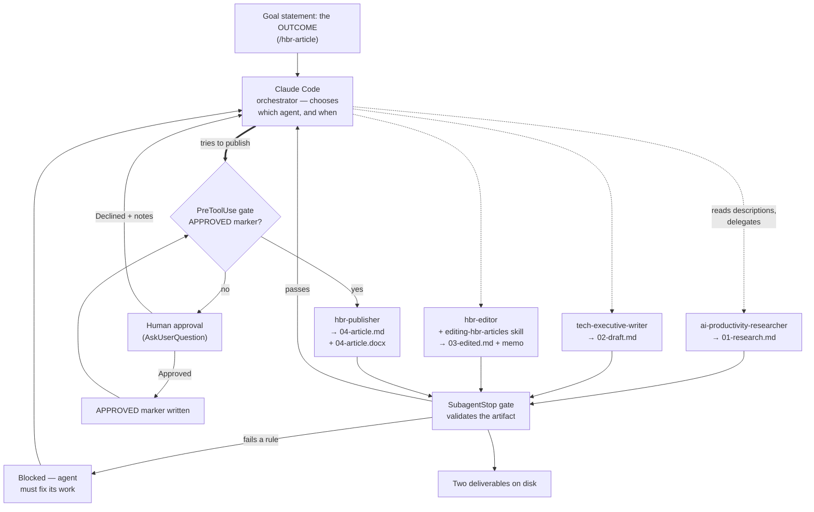

import { Tabs, TabItem } from '@astrojs/starlight/components';

> **AI involvement:** Claude Code delegates to four specialized agents of its own choosing — research, write, edit, publish — with a machine quality gate at every handoff and one enforced human approval gate before publishing.

:::note[At a Glance]
- **Matrix classification:** Autonomous + Augmented
- **AI involvement:** Full — the orchestrator chooses and dispatches specialists that research, write, edit, and publish
- **Human oversight:** One enforced approval gate before publishing; machine gates at every other handoff
- **Best for:** Research-driven content production, multi-step pipelines with specialist roles
- **Complexity:** High — automatic delegation, four subagents, a skill, two hooks, and a rendering script
:::

This is the most detailed worked example on the site. It is a **real, running pipeline**, not an illustration: every file it references exists in the [handsonai repository](https://github.com/jamesgray-ai/handsonai), every rule described here is enforced by code you can read, and the two deliverables land on disk where you can open them.

If you are new to multi-agent design, read the three sections that follow before the mechanics. The vocabulary, the *why*, and the choice of who does the orchestrating matter far more than the wiring.

## The Vocabulary

Six terms carry the whole example.

| Term | What it means | In this pipeline |
|------|---------------|------------------|
| **Orchestrator** | The AI you are talking to. It coordinates but does not do the specialist work itself. | Claude Code |
| **Subagent** | A specialist AI with its own instructions and its own **separate memory**, dispatched by the orchestrator to do one job and report back | `ai-productivity-researcher`, `tech-executive-writer`, `hbr-editor`, `hbr-publisher` |
| **Skill** | A file of codified know-how an agent loads when it needs it | `editing-hbr-articles` — the editorial standards the editor applies |
| **Hook** | A script the *harness* runs automatically at a fixed moment. Not the AI's choice — it fires whether the AI wants it to or not. | Two: a `SubagentStop` hook that inspects each agent's output before it may finish, and a `PreToolUse` hook that blocks publishing until a human approves |
| **Human-in-the-loop gate** | A designed stop where a person decides whether to continue | One approval question, after editing and before publishing — enforced by a hook, not just requested |
| **Automatic delegation** | The orchestrator reads the available agents' descriptions and decides for itself which to dispatch, and when — nobody hands it a sequence | How this pipeline runs by default |

The word doing the most work there is **separate memory**. It is the reason this pattern exists at all.

## Why Four Agents Instead of One Prompt

The obvious objection to multi-agent design is that it looks like overhead. One capable model could research, write, edit, and format in a single long conversation. Sometimes it should. The case for splitting the work rests on two things.

**Specialization.** Each agent carries deep, narrow instructions. The researcher has a tiered source hierarchy and a rule against unsourced claims. The editor has twenty years of HBR standards plus a skill file of cut/replace patterns. No single prompt can hold that much specific expertise across four domains without the instructions blurring into each other.

**Context isolation — the real reason.** A subagent works in its own context window. The researcher's forty browser fetches, dead ends, and rejected sources never enter the writer's context; the writer receives a clean dossier. The orchestrator never holds the full research dump *and* the full draft *and* the full editorial memo at once — only short summaries and file paths. That keeps every participant working with a small, relevant context, which is where models perform best. A single conversation attempting all four jobs accumulates everything, and quality degrades as the context fills with material that is no longer relevant.

The cost is real: coordination, more moving parts, more places to fail. Which brings us to the first real design question.

## Two Ways to Orchestrate

Once you have specialist agents, you must decide **who chooses which agent runs when**. There are two answers, and understanding the difference matters more than any other idea on this page.

### Automatic delegation — the model decides

You state the outcome. Claude Code reads the descriptions of the available agents, works out which specialists the goal calls for, and dispatches them itself. You never name a sequence.

This is what the [goal statement](#the-goal-statement) below does, and what `/hbr-article` saves. It names the topic and one constraint — *delegate this, do not do it yourself* — and then gets out of the way.

### Deterministic orchestration — you decide

You specify the sequence: this agent, then that one, reading this file, writing that one. The orchestrator follows instructions rather than exercising judgment.

This is what `/hbr-article-strict` does. Same agents, same hooks, same deliverables — different decision-maker.

### Which to use

| | Automatic delegation | Deterministic orchestration |
|---|---|---|
| **Who picks the agents** | Claude, from their descriptions | You, in the goal statement |
| **The goal statement specifies** | the outcome | the sequence |
| **Adapts to a new topic** | yes, without changes | yes, but the steps are fixed |
| **Adapts to a new *process*** | yes — add an agent and it may get used | no — you rewrite the sequence |
| **Same path every run** | no | yes |
| **Auditable in advance** | no — you learn the path afterwards | yes — the path is the document |
| **Fails by** | skipping a stage, reordering, or doing the work itself | doing the wrong thing correctly, forever |
| **Best for** | judgment-heavy work, varying inputs, exploration | regulated or high-volume work, and live demonstrations |

Automatic delegation is the more impressive demonstration and the more honest picture of how agentic systems behave. It is also less predictable, and you should know its specific failure modes before you rely on it:

- Claude does the research itself instead of dispatching the researcher, because it has web search too
- It skips the editor and goes straight to publishing
- It dispatches correctly but forgets to pass the workspace path, so the file handoff silently breaks
- It publishes without asking you

### The resolution: the model chooses the path, the harness enforces the outcome

You do not have to pick one. Notice that every failure above is a *path* problem with an *outcome* consequence — and outcomes are exactly what a hook can check.

> **Let the model decide which agent and when. Let the harness enforce what must be true regardless of the path it chose.**

That is the design this pipeline uses, and it is why the hooks matter. Claude improvises the route; the gates guarantee that a thin dossier never reaches the writer, that a critique never masquerades as a finished article, that both deliverables really exist, and that nothing is published without your approval — no matter what order things happened in.

**The gates are not bureaucracy around the autonomy. They are what makes the autonomy safe enough to permit.** Without enforcement you cannot responsibly let a model improvise a publishing pipeline. With it, you can.

## How It Works



Read that diagram for its shape rather than its sequence. The **dotted lines are choices** — Claude decides which specialist to dispatch and when, so there is no fixed left-to-right path. The **solid lines are enforcement** — every subagent's output passes through the `SubagentStop` gate, and every attempt to publish passes through the `PreToolUse` gate, whatever route Claude took to get there.

Three things are worth noticing:

1. **The gates sit after *every* subagent**, not only before publishing.
2. **A blocked agent goes back to work.** The gate is not a dead end; it returns a reason and the agent fixes it.
3. **The human gate and the hook gates are different mechanisms doing different jobs.** That distinction is the most misunderstood part of this design, and it is the next section.

## The Six Design Decisions

Each of these exists because of a specific way the pipeline failed without it. This is the part worth studying — the agents were the easy half.

### 1. Every handoff is a file, not a conversation

Each agent writes its output to a shared workspace directory and returns only a summary of 200 words or less, plus the path.

```
outputs/articles/<slug>/
  00-goal.md              the goal statement as it was run (provenance)
  01-research.md          the research dossier
  02-draft.md             the first draft
  03-edited.md            the publication-ready revision
  03-editorial-memo.md    what changed and why
  04-article.md           deliverable 1 — markdown
  04-article.docx         deliverable 2 — Word
  run-log.md              audit trail, appended by the gate
```

**The failure this prevents:** without it, a research dossier, a 2,000-word draft, and an editorial memo all get passed back and forth as chat text. That is expensive, it degrades as things are re-summarized, and — worst for teaching — it leaves nothing to inspect. With files, you can open `01-research.md` and see exactly what the writer had to work with. When output is disappointing, you can tell *which stage* disappointed.

### 2. A `SubagentStop` hook that validates work

A `SubagentStop` hook fires when any subagent finishes. This one reads the workspace and blocks the agent from finishing if its output does not meet a floor:

| It checks | It blocks when |
|---|---|
| Something was produced | the agent finished without writing any file |
| Research substance | the dossier is thin or carries fewer than three source URLs |
| Draft length | the draft is far under the word target |
| **The editor actually edited** | `03-edited.md` is missing its memo, has lost its citations, or still contains critique markers like `**Original**:` |
| **Both deliverables exist** | `04-article.md` exists but `04-article.docx` is missing or is not a real Word file |

A blocked agent receives the reason as an instruction and fixes its work before finishing. Nothing reaches the next stage on a promise.

**The failure this prevents:** the last row is not hypothetical. An earlier version of this pipeline finished cheerfully and produced *two markdown files and no document*, because the publisher agent described a document instead of creating one. Agents report success readily. A hook is code, and code does not take an agent's word for it.

:::note[What a hook can and cannot do]
A hook is a script run by the harness, not by the AI — so it cannot be talked out of its verdict. But it also **cannot ask you anything**: hooks run with no terminal attached, so a hook that tries to prompt for a yes/no answer can never receive one. This pipeline originally shipped a `read -p "Approve? [y/n]"` script for exactly that purpose, and it could never have worked. Machine-checkable rules belong in the hook; human judgment belongs in the orchestrator.
:::

### 3. The human gate is asked by the orchestrator and enforced by a second hook

Because a hook cannot converse, the *question* has to come from the orchestrator. After the editor finishes, Claude Code shows you the memo's headline changes, the article's title and opening, and the file paths, then asks whether to publish. Decline and your notes go back to the editor for up to two more rounds.

But under automatic delegation, "you were told to ask first" is precisely the instruction most likely to be skipped — and publishing without asking is the one failure you cannot take back. So the request is backed by enforcement. A **`PreToolUse` hook inspects every subagent dispatch**. If Claude tries to launch `hbr-publisher` and no approval marker exists in the workspace, the harness refuses to launch it and tells Claude to come back and ask you:

```
BLOCKED: publishing requires human approval first.

You tried to dispatch hbr-publisher, but no approval marker exists at:
  outputs/articles/<slug>/APPROVED
...
```

Claude then asks, you decide, and only on a yes does the marker get written and the dispatch succeed. Two hook events, two different jobs: `SubagentStop` checks work that has been done, `PreToolUse` prevents work that should not start.

:::note[A guardrail, not a security boundary]
Claude could write that approval marker itself. This hook does not make bypassing you impossible — it makes it a **deliberate act rather than an accident**, and it leaves an audit trail of every dispatch attempt. Be clear-eyed about which of your controls are guardrails against drift and which are genuine boundaries. Most are guardrails, and that is usually enough; pretending otherwise is how people end up trusting a control that was never load-bearing.
:::

**Why one human gate and not four?** Because a review gate you click through is worse than no gate — it trains you to approve without reading. Put the human where the decision is genuinely theirs: publishing is the irreversible, reputation-bearing step. The machine handles the mechanical checks at every other handoff.

### 4. The editor produces a revision, not a critique

`hbr-editor` writes two files: the finished article with edits already applied, and a separate memo explaining them.

**The failure this prevents:** in its original form the editor returned only feedback — "Original / Suggested / Why" blocks and a priority list. Excellent feedback, and completely unpublishable. The arrow into the publisher carried commentary, and nothing in the pipeline applied the edits. This is a general lesson about agent chains: an agent whose output is *advice* cannot sit mid-pipeline unless something downstream acts on it. Check that each agent's output is genuinely the next agent's input.

### 5. Document layout is code, not improvisation

The Word file is produced by a checked-in, tested script — [`scripts/article-to-docx.js`](https://github.com/jamesgray-ai/handsonai/blob/main/scripts/article-to-docx.js) — rather than by the agent writing fresh layout code each run.

**The failure this prevents:** an agent improvising document layout produces a slightly different document every time — different margins, a lost title page, a heading that stops appearing in Word's navigation pane. For a live demonstration, "different every time" is the failure mode you cannot afford. Anything about your output that should be identical on every run belongs in version control, not in a prompt. The agent still *decides* what the article says; the script decides what a page looks like.

The publisher then **looks at its own output**: it converts the `.docx` with LibreOffice, renders the pages as images, and reads them to confirm the title page and heading hierarchy came out right.

### 6. Agent descriptions carry the chain

This is the decision that makes automatic delegation work, and the one most often missed.

Claude chooses which agent to dispatch by reading each agent's `description` field. Nothing else. So if the descriptions only say *when a human would want this agent*, Claude has no way to know that the writer follows the researcher, or that the publisher comes last. It will guess, and it will guess differently each run.

These four agents were originally written for interactive use, and their descriptions read accordingly: *"use this agent when the user needs to create business-focused content…"* — accurate, and useless for chaining. Each now also states its place in the pipeline:

> **Use PROACTIVELY as the DRAFTING step of a content pipeline**, once a research dossier exists (e.g. `01-research.md` from ai-productivity-researcher). It writes the full draft from that dossier — do not write the prose yourself. In a pipeline it produces `02-draft.md`, which then goes to hbr-editor for editing.

Three things make that work: it names **when** the agent belongs, it names the **agents on either side of it**, and it explicitly says **do not do this work yourself** — which is the instruction that stops the orchestrator from quietly collapsing your pipeline into one conversation.

**The failure this prevents:** with the original descriptions, automatic delegation produced whatever order seemed reasonable in the moment, sometimes skipping the editor entirely. Under automatic delegation, **your agent descriptions are your workflow definition.** If the chain isn't in the descriptions, it isn't anywhere.

## The Cast

All four agents and the skill live in this repository under `.claude/`, where Claude Code loads them automatically for any session started in the project.

| Component | Type | Role | Reads | Writes |
|-----------|------|------|-------|--------|
| [`ai-productivity-researcher`](https://github.com/jamesgray-ai/handsonai/blob/main/.claude/agents/ai-productivity-researcher.md) | Agent | Finds documented case studies with quantified outcomes from Tier 1–2 sources | the goal | `01-research.md` |
| [`tech-executive-writer`](https://github.com/jamesgray-ai/handsonai/blob/main/.claude/agents/tech-executive-writer.md) | Agent | Writes the article for a business leadership audience | `01-research.md` | `02-draft.md` |
| [`hbr-editor`](https://github.com/jamesgray-ai/handsonai/blob/main/.claude/agents/hbr-editor.md) | Agent | Applies HBR editorial standards and produces the revision | `02-draft.md` | `03-edited.md`, `03-editorial-memo.md` |
| [`editing-hbr-articles`](https://github.com/jamesgray-ai/handsonai/tree/main/.claude/skills/editing-hbr-articles/) | Skill | The editorial criteria the editor loads before working | — | — |
| [`hbr-publisher`](https://github.com/jamesgray-ai/handsonai/blob/main/.claude/agents/hbr-publisher.md) | Agent | Produces both deliverables and visually verifies the Word file | `03-edited.md` | `04-article.md`, `04-article.docx` |
| [`subagent-gate.sh`](https://github.com/jamesgray-ai/handsonai/blob/main/.claude/hooks/subagent-gate.sh) | Hook (`SubagentStop`) | Validates each stage's output before the agent may finish | the workspace | `run-log.md` |
| [`publish-gate.sh`](https://github.com/jamesgray-ai/handsonai/blob/main/.claude/hooks/publish-gate.sh) | Hook (`PreToolUse`) | Blocks the publisher from being dispatched until a human has approved | the dispatch + `APPROVED` | `.dispatch-log` |
| [`article-to-docx.js`](https://github.com/jamesgray-ai/handsonai/blob/main/scripts/article-to-docx.js) | Script | Renders the markdown as a formatted Word document | `04-article.md` | `04-article.docx` |

Each agent also declares a **least-privilege tool list**. The writer has no web access, so it cannot quietly invent a source that was not in the dossier — it can only write from what the researcher found. Restricting tools is a design instrument, not just a safety measure.

## Every Agent Gets the Same Five Instructions

The four agents were written originally for interactive, one-at-a-time use. Turning them into pipeline components took one added section each — a "Workspace Mode" that activates only when the prompt supplies a workspace path, so interactive use is unaffected. If you convert your own agents, these are the five things to tell each of them.

1. **Read this file, write that file.** Name both explicitly.
2. **Return a summary, not the work.** 200 words and the path. The whole context-isolation benefit is lost if agents paste their output back.
3. **Never ask clarifying questions.** A subagent has no one to ask — no human is listening. This is the most common mistake when promoting an interactive agent to a pipeline role. Tell it to make the call and record the judgment under an `## Assumptions` heading instead.
4. **State what the quality gate will check**, so the agent aims above the floor rather than discovering it by being blocked.
5. **Say what to do if blocked:** fix exactly what the gate named.

## The Goal Statement

**This is the goal statement for the whole multi-agent system.** It is the only thing you type. Two paragraphs start four agents, produce seven files, and deliver two documents.

```text
Write an HBR-style article for senior business leaders on companies that have
successfully deployed AI agents, and what separated them from the ones still
running pilots.

Delegate every stage to the specialist subagents. Do not research, write, edit, or
publish any of it yourself. Stop and ask me to approve before anything is published.
```

That is the complete prompt — nothing is omitted here for brevity. It has exactly two jobs:

| Paragraph | What it does |
|---|---|
| **1 — the goal** | The topic, the audience, and the form. The only genuinely per-run information. |
| **2 — the delegation constraint** | Tells Claude to route the work to specialists rather than doing it, and to stop for your approval before the irreversible step. |

Notice what it does **not** contain: no sequence, no agent names, no filenames, no workspace path, no word count, no evidence standard. Claude decides which specialists to use and when; everything else already lives in the system.

The saved equivalents are [**`/hbr-article`**](https://github.com/jamesgray-ai/handsonai/blob/main/.claude/commands/hbr-article.md), which is this same goal statement plus the workspace setup so it works in any project, and [**`/hbr-article-strict`**](https://github.com/jamesgray-ai/handsonai/blob/main/.claude/commands/hbr-article-strict.md), which spells out the four stages in fixed order as the deterministic contrast.

For a live demonstration, **type the goal statement rather than the slash command.** A slash command looks like a script; two sentences of plain English producing four delegated agents and two documents looks like what it actually is.

### Where this started

The original prompt for this pipeline read:

> *"Please write an analysis and Harvard Business Review-style article on successful companies that you can find by doing research that have successfully used and applied AI agents to their business. This article is for a business leadership audience, and I'd like to have the final deliverable as a PDF, and markdown file."*

Nothing is wrong with it as a *request*. It was inadequate as an *orchestration instruction*, because it named no workspace, no filenames, no evidence bar, and no review point — so every run improvised its own answers and no two runs matched.

The obvious fix was to specify all of it, and the first working version of this goal statement ran to 250 words. The better fix was to move it into the system.

### Why the goal statement can be this short

That 250-word version named the workspace, listed all six filenames, and restated the evidence and length standards on every single run. Almost all of it was the prompt telling the system things the system already knew.

| Once in the prompt | Now lives in | Why there is better |
|---|---|---|
| The six artifact filenames | Each agent's Workspace Mode | The writer already knows it reads `01-research.md` and writes `02-draft.md`. Restating the wiring adds nothing. |
| "At least 5 named companies, sources within 24 months" | `ai-productivity-researcher` | A standard, not a per-run decision. It should hold on every run, including ones where you forget to ask. |
| "2,000–2,500 words, one big idea" | `tech-executive-writer` | Same — and it overrides the agent's own wider 2,000–4,000 default when running in a pipeline. |
| The workspace path and gate arming | `CLAUDE.md` (or the slash command) | A project convention, not something to retype. |
| "Read the agents' descriptions and pick" | Nothing — deleted | Claude Code surfaces available subagents automatically. Telling it to do so is telling it to do its job. |

What survives is only what varies per run, plus the one instruction that genuinely fails without it:

- **The topic** — the only truly unique information.
- **"Do not… yourself"** — the load-bearing line. Claude is entirely capable of doing the research, and doing it is faster than delegating. Without this, four agents quietly collapse into one conversation and you will not notice, because the article still arrives.
- **"Ask me to approve"** — the `PreToolUse` hook enforces this regardless, but the line is what makes Claude *ask* rather than get blocked and have to recover.

**This is the real lesson of the example.** A long prompt is a smell: it means the expertise is living in your message instead of in your system. Every standard you move out of the prompt and into an agent, a hook, or a project convention is a standard that now holds on every run — including the runs where you forget to mention it. The prompt shrinks as the system matures.

:::note[If you are running this outside this repository]
The workspace convention lives in this repo's `CLAUDE.md`. Elsewhere — for example after installing the plugin into your own project — either use `/hbr-article`, which is self-contained, or add one line to the prompt: *"Use outputs/articles/ai-agents-in-production/ as the workspace and arm the gates first."*
:::

## Run It Yourself

You need [Claude Code](../../../builder-setup/) and [Node.js](../../../builder-setup/), plus a terminal. Every step is a copy-paste.

<Tabs>
  <TabItem label="From this repository">

**1. Clone the repository and install dependencies.**

```bash
git clone https://github.com/jamesgray-ai/handsonai.git
cd handsonai
npm install
```

The `docx` package that generates the Word file installs with everything else.

**2. Start Claude Code in the project folder.**

```bash
claude
```

Starting it *inside the project* is what loads the agents in `.claude/agents/`, the skill in `.claude/skills/`, and the hook in `.claude/settings.json`.

:::caution[Hooks load only at startup]
Claude Code reads hook configuration once, when the session begins. If you add or change a hook while a session is running, **it does not take effect until you exit and start a new session**. A gate you believe is protecting you but that never loaded is worse than no gate — it is silent. Run `/hooks` to confirm what is actually loaded.
:::

**3. Run the pipeline.** Either paste [the goal statement](#the-goal-statement) — better for a live audience — or use the saved version:

```
/hbr-article
```

Or with your own topic:

```
/hbr-article how mid-market manufacturers are using AI agents in procurement
```

This is the automatic-delegation version: it states the outcome and lets Claude choose the specialists. To see the deterministic contrast — the same agents driven by an explicit sequence — run `/hbr-article-strict` instead. Running both on the same topic and comparing the transcripts is the single most instructive thing you can do with this example.

**4. Watch the delegation happen.** This is the part to watch closely. Claude announces which agent it is dispatching and why, and each agent reports back a short summary and a file path. Open the files as they appear — that is where the learning is. `01-research.md` shows you the raw evidence; `02-draft.md` shows you what the writer made of it.

Watch for a gate firing, too. If an agent returns something thin, you will see it blocked and sent back to work. That is the system defending itself, and it is worth pausing on.

**5. Answer the approval question.** Claude will ask whether to publish, with the headline editorial changes and file paths in front of you. Open `03-edited.md` and actually read it. Approve, or decline with notes and watch the editor revise.

If Claude tries to publish *without* asking, the `PreToolUse` hook blocks the dispatch and sends it back to ask you. Seeing that happen live is a better demonstration of human-in-the-loop than any diagram — the harness physically stopping the AI mid-action.

**6. Collect your deliverables.**

```
outputs/articles/<slug>/04-article.md
outputs/articles/<slug>/04-article.docx
```

Open the `.docx` in Word and export a PDF if you want one — *File → Save As → PDF*.

**7. Read the audit trail.** `run-log.md` records every stage the gate passed and when. In a production pipeline this is what you would show someone asking how a document was produced.

  </TabItem>
  <TabItem label="Verify the machinery yourself">

Both pieces of enforcement have tests you can run. Do this before demonstrating the pipeline to anyone — it confirms the gate really blocks and the renderer really renders.

```bash
bash .claude/hooks/test-subagent-gate.sh
bash .claude/hooks/test-publish-gate.sh
bash scripts/test-article-to-docx.sh
```

The first builds synthetic workspaces and asserts the `SubagentStop` gate blocks a thin dossier, an uncited dossier, a short draft, a revision missing its memo, a critique masquerading as a revision, a missing Word file, and a corrupt Word file — and that it stays completely inert when the pipeline is not running.

The second asserts the `PreToolUse` gate blocks a publisher dispatch without an approval marker, allows it with one, ignores every other agent and tool, stays inert outside a pipeline run, and fails *open* on a payload it does not recognise — because a gate that wedges a live demonstration is worse than one that occasionally misses.

The third renders a fixture article and asserts the output is a valid Word file with its heading styles, hyperlinks, and pagination intact.

You can also drive the renderer directly on any markdown file with frontmatter:

```bash
node scripts/article-to-docx.js path/to/article.md path/to/article.docx
```

  </TabItem>
  <TabItem label="Adapting without Claude Code">

The pattern does not require Claude Code; the *automation* does. You can run the same pipeline by hand in any AI tool, using a separate conversation per stage — which is a genuinely useful way to feel why context isolation matters.

1. **Research** — in a tool with web search: *"Find 5-7 documented case studies of companies successfully using AI agents, with quantified business outcomes. Prioritize HBR, McKinsey, Forrester, or major business publications, published in the last 24 months. Cite every claim with a link."* Save the output to a file.
2. **Write** — in a **new** conversation, paste the research and ask for a 2,000–2,500 word article for business leaders, with every claim traceable to what you pasted. Save it.
3. **Edit** — in another new conversation, paste the draft and ask for the fully revised article plus a separate list of what changed and why. Save both.
4. **Review** — read the revision yourself. This is your approval gate.
5. **Publish** — format it however you like.

Starting each stage fresh is the manual equivalent of a subagent's clean context. What you lose is enforcement: no gate checks the dossier has citations, and nothing stops you from accepting a draft that quietly dropped its sources. That gap is exactly what the hook exists to close.

  </TabItem>
</Tabs>

## What Went Wrong Building This

The most useful part of the example, and the part usually left out.

| What happened | What it teaches |
|---|---|
| The publisher produced two markdown files and no document, reporting success | Agents describe deliverables as readily as they produce them. Verify artifacts with code, not with the agent's summary. |
| The editor returned critique that nothing downstream applied | Check that each agent's output is genuinely the next agent's input. Advice cannot sit mid-pipeline. |
| An approval script used `read -p` inside a hook, where no terminal exists | Know your mechanism's limits. Hooks enforce; they cannot converse. |
| A gate written before the workspace convention keyed on the agent's name — which the hook payload does not reliably provide | Validate *state*, not identity. Checking which files exist and whether they are sound is more robust than trusting metadata. |
| The gate would have fired on every unrelated subagent in the repository | Scope automation deliberately. An activation flag keeps the gate inert unless a pipeline run is genuinely in progress. |
| Writing the pipeline's first `.docx` failed silently until the renderer was tested against a real Word file | Test the boring plumbing. The interesting AI part is rarely what breaks. |
| The gate passed its unit tests but rejected every *real* Word file, because a `grep -q` in a pipeline made a successful match look like a failure once the file was large enough | Test with real artifacts, not only small fixtures. This bug was invisible at fixture size and would have blocked every genuine publish. |
| The agent descriptions described when a *human* would want each agent, so automatic delegation had nothing to chain on | Under automatic delegation, the descriptions *are* the workflow. Write them for the orchestrator, not only for the user. |

## When Not To Use This Pattern

Multi-agent orchestration is the wrong reach for most tasks. Prefer a single conversation when:

- **The stages need each other's full reasoning.** Isolation is the benefit; if stage three genuinely needs everything stage one considered, you are fighting the pattern.
- **You cannot say what "done" looks like for each stage.** If you cannot name the file each agent must produce, you cannot gate it, and an ungated pipeline is just a long prompt with extra steps.
- **The task is short.** Four dispatches to produce three paragraphs costs more than it returns.
- **The work is genuinely exploratory.** Pipelines suit repeatable processes. If you are still discovering the shape of the problem, iterate in one conversation first — then build the pipeline once the shape stops moving.

A useful test: **if you would assign the stages to different people on a team, they are candidates for different agents.** If one person would naturally do all of it in one sitting, use one conversation.

## Adapting It To Your Own Work

The article pipeline is one instance of a shape that fits any workflow where distinct stages need distinct expertise and the output must be trustworthy:

- **Client deliverable** — researcher gathers data → analyst produces insights → writer drafts the report → reviewer checks quality → formatter produces the document
- **Sales proposal** — researcher profiles the prospect → writer drafts → pricing specialist adds numbers → reviewer verifies → formatter delivers
- **Course content** — researcher gathers material → designer structures the lesson → writer creates slides and exercises → editor reviews → publisher formats for the LMS
- **Competitive intelligence** — scanner monitors competitor channels → analyst identifies changes → writer summarizes → editor verifies → distributor sends

To convert one of these, work in this order:

1. **Name the stages** and the file each one produces. If you cannot name the file, the stage is not yet defined.
2. **Write the specialist instructions** for each stage, and give each the five workspace-mode instructions above.
3. **Write the descriptions for the orchestrator**, not only for yourself — name each agent's place in the chain, the agents on either side of it, and that the orchestrator must not do that work itself. This is what makes automatic delegation possible.
4. **Decide what a machine can check** at each handoff — presence, length, citations, format validity — and put exactly that in a `SubagentStop` hook. Keep it to things that are objectively true or false.
5. **Place the human gate** at the irreversible step, and back it with a `PreToolUse` hook so it survives an orchestrator that forgets to ask. One gate, and make it a real decision.
6. **Move anything that must be identical every run** — layout, naming, structure — out of the prompts and into a script.
7. **Write the goal statement last**, once you know the filenames. State the outcome if you want delegation, the sequence if you want repeatability. Save it as a slash command either way.

## Related

- [Multi-Agent Collaboration](../../../agentic-building-blocks/agents/capability-patterns/multi-agent-collaboration/) — the capability pattern behind this example
- [Human-in-the-Loop](../../../agentic-building-blocks/agents/capability-patterns/human-in-the-loop/) — designing review gates that are real decisions
- [Orchestrator-Workers](../../../patterns/workflow-architecture/orchestrator-workers/) — the architectural pattern in the abstract
- [Prompt Chaining](../../../patterns/workflow-architecture/prompt-chaining/) — the simpler pattern to reach for first
- [Agents](../../../agentic-building-blocks/agents/) — what agents are and when they earn their complexity
- [Skills](../../../ai-workflow-framework/skills/) — codifying know-how into loadable files
- [Deterministic Automation Example](../deterministic-automation/) — when AI follows fixed rules and needs no judgment
- [AI Collaborative Example](../ai-collaborative/) — when human and AI iterate together instead
- [Claude Code Subagents Documentation](https://code.claude.com/docs/en/sub-agents) — the official reference
- [Claude Code Hooks Documentation](https://code.claude.com/docs/en/hooks) — every hook event and its payload
